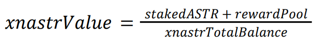
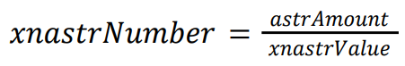
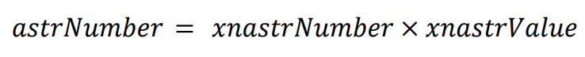

# 🪙 xnASTR

To achieve the mentioned goals, a rewards-bearing architecture has been chosen with xnASTR as a liquid token. The "x" in xnASTR denotes its cross-chain nature due to its XC20 format.&#x20;

This mechanism eliminates the need for manual claiming of staking rewards; instead, they accumulate on the liquid staking contract, and the xnASTR/ASTR ratio steadily increases over time.&#x20;

The xnASTR price is determined by the following equation:&#x20;

<figure><figcaption></figcaption></figure>

**stakedASTR**: the whole number of ASTR staked;&#x20;

**rewardPool**: a pool where all staking rewards are accumulated. Additionally, it is used as the fund for the immediate unstaking function.&#x20;

**xnastrTotalBalance**: the whole number of xnASTR minted.

### Staking and xnASTR minting&#x20;

A user stakes their ASTR through the liquid staking form and receives liquid xnASTR tokens back. The number of xnASTR tokens to receive is determined by the following equation:

<figure><figcaption></figcaption></figure>

### Unstaking&#x20;

A user unstakes their ASTR through the liquid unstaking form. The number of ASTR tokens to receive is determined by the following equation:

<figure><figcaption></figcaption></figure>
