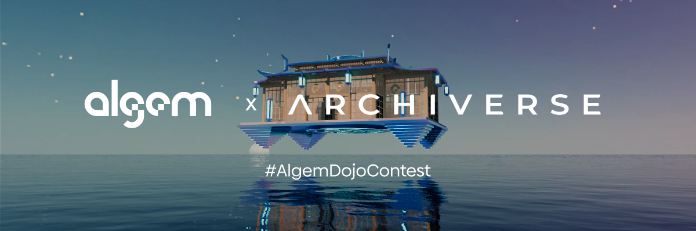

# 🖼️ NFT Collections

Algem is the first project on Astar network to experiment with NFT collections and Defi services. Owning one or more of our NFTs gives its owner advantages over Algem's Defi products, such as discounts on fees, increased APR, access to private groups and other gifts.

Algem currently has three NFT collections:

* Algemantis
* Liquid Staking Discount
* Algem x Archiverse Dojo

## Algemantis NFT Collection

<figure><figcaption></figcaption></figure>

Algemantis is Algem's core NFT collection and represents Algem's Senators, a group of dedicated users who participate in Algem's important decisions and have access to early releases.

The birth of algemantis is accompanied by the story of Algem's conception by the founding team, and can be discovered on the Algemantis website.

**NFT contract name :** Algemantis Nautilus Pass\
**NFT contract address:** [0x170a3768117a9ae6939ea46c1b4265e94de44534](https://blockscout.com/astar/address/0x170a3768117A9Ae6939EA46c1b4265e94De44534)\
**Supply:** 246 ANP

### Benefits of owning a Algemantis NFT :

* APR Booster for the Liquid Farming ALGM Incentives
* Private NFT and tokens airdrops
* Regular private incentivized contests and polls
* An access to the private group in Algem Discord
* Discussion of the governance decisions

Algemantis NFTs can be traded on the secondary market on Bluez or Tofu NFT :

[https://bluez.app/algemantis\_nautilus\_pass](https://bluez.app/algemantis_nautilus_pass)\
[https://tofunft.com/collection/algemantis-nautilus-pass/items](https://tofunft.com/collection/algemantis-nautilus-pass/items)

## Liquid Staking Discount NFT

<figure><figcaption></figcaption></figure>

Liquid Staking Discount NFT is a collection of NFTs offering their owners a discount on the reward fee for using Aglem's Liquid dApp Staking feature.

Holding a NFT gives a 10% discount on the 10% staking reward fee, bringing the fee down to 9% instead of 10%. The bonus is not cumulative if holding one or more NFTs at the same address.

**NFT contract name:** Algem Liquid Staking Discount\
**NFT contract address:** [0xF0F9238013af5982f97A347D190181F200Ad68CD](https://blockscout.com/astar/token/0xF0F9238013af5982f97A347D190181F200Ad68CD/token-transfers)\
**Supply:** 66 ALSD

Liquid Staking Discount NFT can be traded on the secondary market on Bluez or Tofu NFT :

[https://bluez.app/algem\_liquid\_staking\_discount](https://bluez.app/algem_liquid_staking_discount)\
[https://tofunft.com/collection/algem-liquid-staking-discount/items](https://tofunft.com/collection/algem-liquid-staking-discount/items)

## Algem x Archiverse Dojo

<figure><figcaption></figcaption></figure>

This NFT was offered by Algem to reward all the users who completed the campaign #AlgemDojoContest.

The DOJO has been fully developed and modeled in 3D with reference to Algem and Astar’s colors. The building takes its archetype from traditional Japanese craftsmanship while adding neo-futuristic elements to generate a new spatial and visual experience.

The space offered within the dojo is thought of as being, a practice area, a place where you meditate, repeat exercises and celebrate learning.

It will allow you to remember your participation in the Algem event. Along with the #AlgemDojoContest campaign, you perfected your art by completing different quests in order to discover Astar decentralized ecosystem and Algem application.

As of now, you have your personal DOJO which will forever bring back memories of this special time of learning and intimate development. It will allow you, in turn, to transmit the knowledge you’ve learned while bringing in new users.

_Developed and built by Archiverse (www.archiverse.art)_

**NFT contract name:** Algem Dojo\
**NFT contract address:** [0xeBdA851087FF6A75961781987B9f1F7832D9DeB0](https://blockscout.com/astar/token/0xeBdA851087FF6A75961781987B9f1F7832D9DeB0/token-transfers)\
**Supply:** 160 AD

Algem x Archiverse Dojo NFT can be traded on the secondary market on Bluez or Tofu NFT :

[https://bluez.app/algem\_dojo](https://bluez.app/algem_dojo)\
[https://tofunft.com/collection/algem-archiverse-dojo/items](https://tofunft.com/collection/algem-archiverse-dojo/items)
