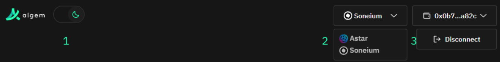
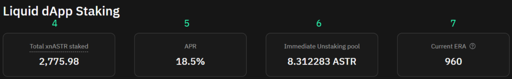
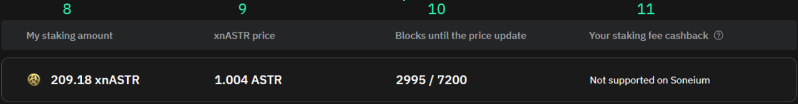
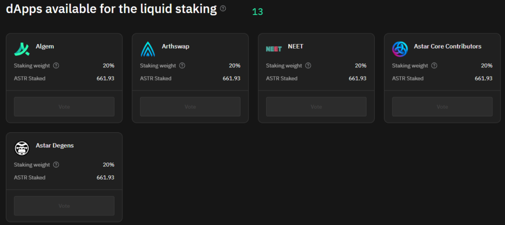
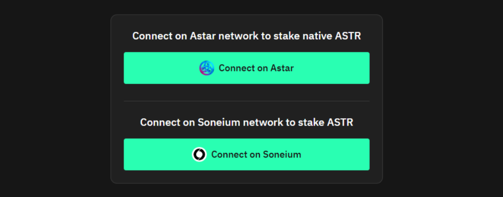
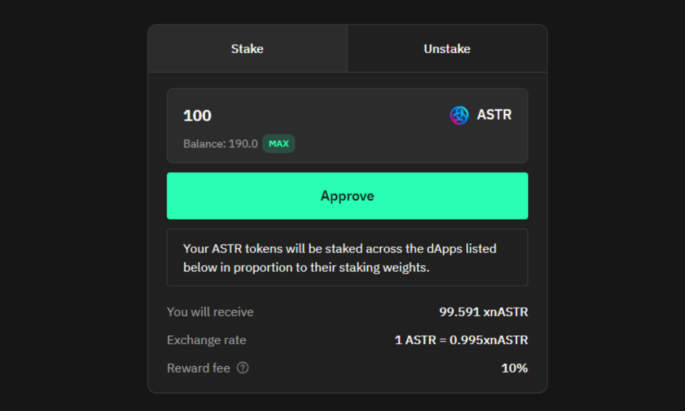
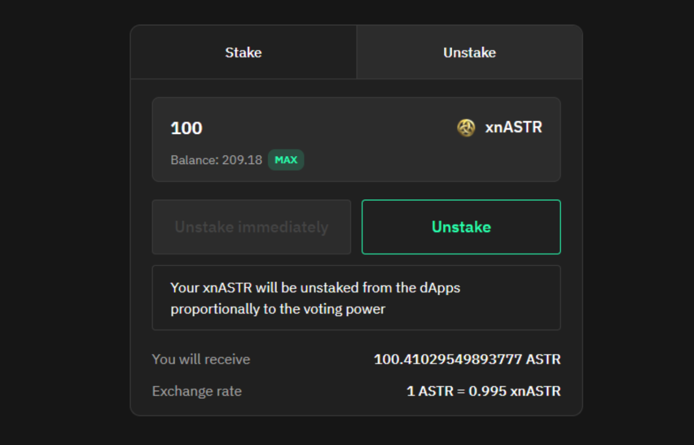
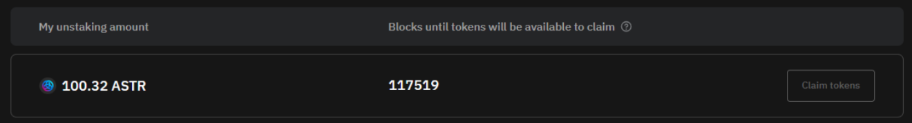

# 🚀 How to use Algem's Liquid dApp Staking V2.0 (new)

### Liquid dApp Staking dashboard overview&#x20;

#### Header

<figure><figcaption></figcaption></figure>

1. Toggle between light and dark themes.
2. Switch between available networks: Astar and Soneium.
3. Disconnect the connected wallet.

#### General Information about Liquid dApp Staking

<figure><figcaption></figcaption></figure>

4. TVL: Displayed in both ASTR and USD.
5. APR: Includes bonus rewards and re-staking of dApp staking rewards.
6. Immediate Unstaking Pool Size: If your unstake amount is less than the pool size, you can unstake tokens instantly without waiting for the unlock period.
7. Current ERA: On Astar Network, rewards are distributed once per ERA. One ERA equals 7,200 blocks or approximately 24 hours.

#### Your Stake and Rewards Information

<figure><figcaption></figcaption></figure>

8. Stake Amount: Displayed in xnASTR.
9. Current xnASTR Price: Shown relative to ASTR.
10. Blocks until the price update: After the specified number of blocks, the next staking rewards will be distributed, increasing the price of xnASTR relative to ASTR.
11. Algem Discount NFT Holders: Eligible for cashback on staking management fees by locking their NFT.

#### Staking/Unstaking Form

<figure><figcaption></figcaption></figure>

#### dApps available for Liquid Staking

<figure><figcaption></figcaption></figure>

Your ASTR tokens will be staked across the dApps listed below, in proportion to their staking weights.

For example:

dApp 1: the staking weight is 100 veALGM / 22,(22)%

dApp 2: the staking weight is 150 veALGM / 33,(33)%

dApp 3: the staking weight is 200 veALGM / 44,(44)%

When a user stakes 1,000 ASTR, the distribution of their tokens among the dApps is as follows:

dApp 1: 22,(22)% × 1,000 = 222.22 ASTR

dApp 2: 33,(33)% × 1,000 = 333.33 ASTR

dApp 3: 44,(44)% × 1,000 = 444.44 ASTR

This works the same for unstaking.

dApps available for Liquid Staking

#### Initial dApps:

* Algem
* Astar Core Contributors
* Astar Degens
* Arthswap
* NEET

Astar Core Contributors and Astar Degens were added without voting due to their long-standing partnership with Algem. Arthswap and NEET were chosen through a two-stage voting process:

1. Preliminary voting on Algem Discord identified four finalists.
2. [Final voting was conducted on X](https://x.com/Algem_io/status/1877732179104739705).

New dApps will be periodically added based on user votes conducted via veALGM after the ALGM token launch.

### How to use Liquid dApp Staking&#x20;

#### Network Selection and Wallet Connection

<figure><figcaption></figcaption></figure>

Go to the Liquid dApp Staking V2.0 page and select the network you want to stake on.

* On Astar Network, you stake native ASTR.
* On Soneium, you stake the ERC20 version of ASTR.

To transfer ASTR from Astar to Soneium, use the [bridge on the Astar Network portal.](https://portal.astar.network/astar/bridge)

#### Staking

<figure><figcaption></figcaption></figure>

* Select the staking window and enter the desired amount (minimum 100 ASTR), then confirm the transaction.
* On Astar Network, staking requires a single transaction.
* On Soneium, you need to first approve the token (setting a spending limit) and then confirm the staking transaction.

Note:&#x20;

When staking on Soneium, ASTR tokens are sent to Astar Network and xnASTR tokens are returned. This cross-chain transfer is performed via Chainlink CCIP and may take up to 1 hour.

In case of a failed transaction, your ASTR tokens will be returned to your address.

After staking, your xnASTR balance will appear on the dashboard (tokens transferred to another address or used in DeFi apps will not be shown on the dashboard!).

#### **Adding xnASTR to Web3 Wallet**

Use the contract address below to add xnASTR to your wallet (same for Astar Network and Soneium):

0x7274364543EDd6cd5cE59AD64b12e5F5837Bb2f3

In Metamask:

* Click the app icon in your browser.
* Go to the Tokens tab.
* Click the 3 dots tab select the Import tokens option.
* Enter the contract address in the Custom Token field and import it into your wallet.

#### Unstaking

<figure><figcaption></figcaption></figure>

* Click the unstake tab and enter the desired amount (minimum 100 xnASTR), then confirm the transaction.
* On Astar Network, unstaking requires a single transaction.
* On Soneium, you first approve the token (setting a spending limit) and then confirm the unstaking transaction.

Two unstaking options are available here:

* Unstake Immediately: If the Immediate Unstaking Pool has enough tokens, the "Unstake Immediately" button will be active, allowing you to withdraw instantly without waiting for the standard 10-ERA period (\~10 days).
* Standard Unstaking: If the pool is insufficient or you prefer to wait, use the standard unstaking option (10–12 ERAs, approximately 10–12 days).

#### **Withdrawing Tokens**

<figure><figcaption></figcaption></figure>

After initiating standard unstaking, the dashboard will display a new My Unstaking Amount field. Once this unstaking period ends, the Claim Tokens button will become active, allowing you to withdraw your ASTR tokens.
