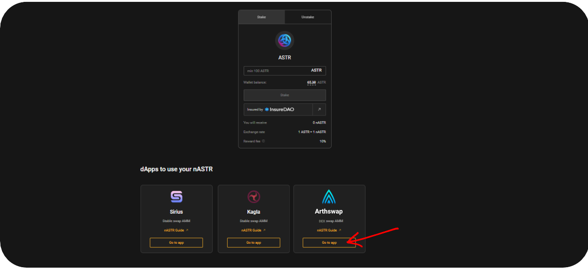
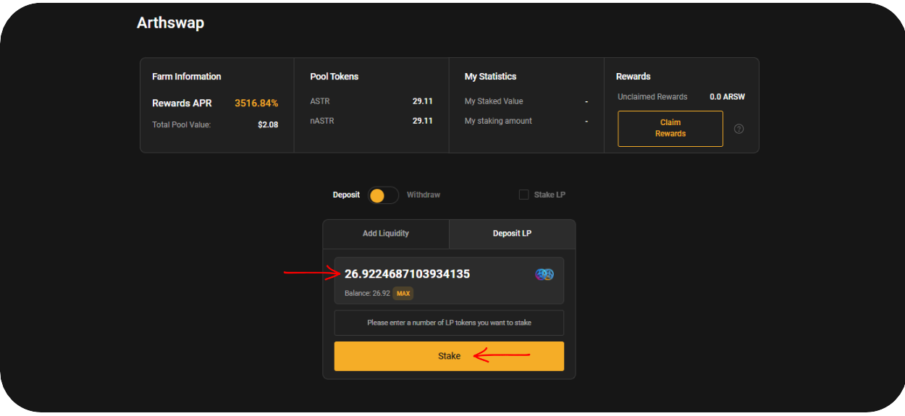
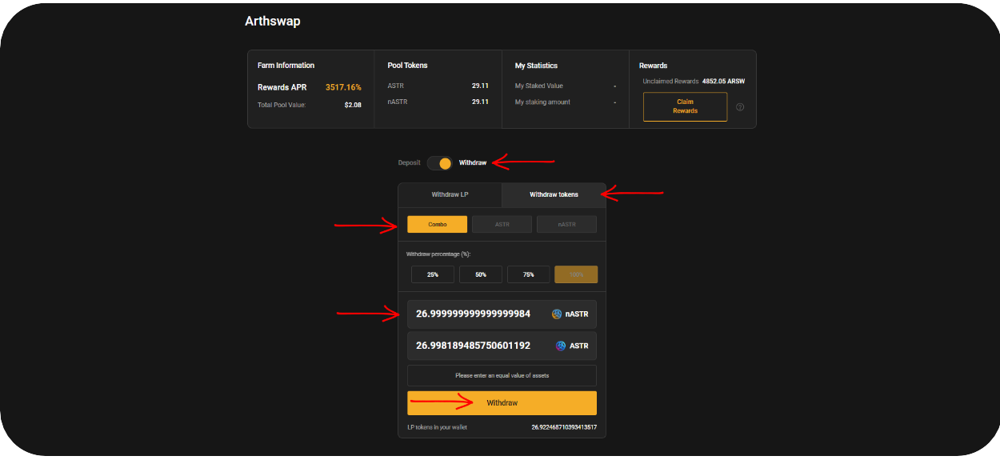
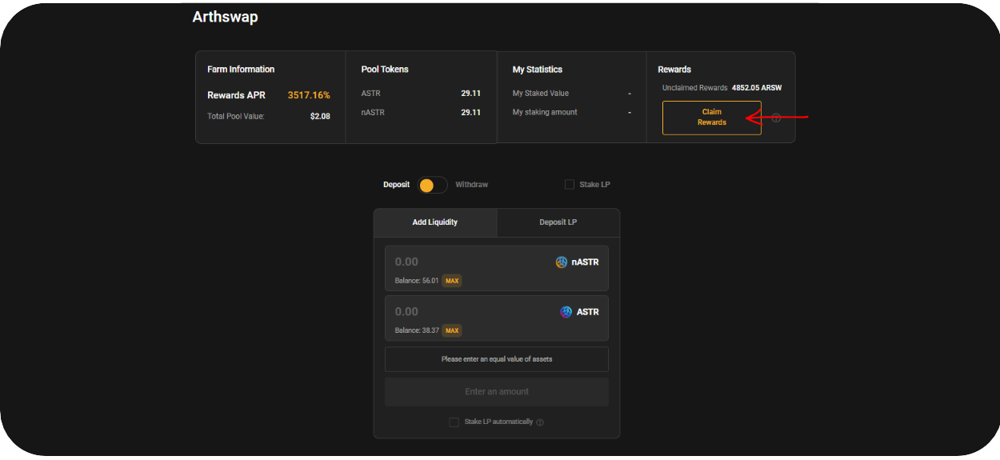

# 🥕 Arthswap

With simple UI, [ArthSwap](https://www.arthswap.org/) enables High-Frequency Trade on Astar Network. ArthSwap is a one-stop DeFi protocol that aspires to be the main DEX on the Astar Network. Their primary products are trading, staking, IDO launchpad, and liquidity farming, with other capabilities to be consistently added.

Algem’s nASTR Farming is now supporting Arthswap. nASTR holders can deposit their tokens to provide liquidity in the nASTR:ASTR pair. In return, they will receive LP tokens and can stake them on Algem to earn extra trading fees and rewards from Arthswap farms.

### **How to farm nASTR/ASTR with Arthswap**

#### Provide liquidity and stake LP tokens

* Once you have staked ASTR tokens on [algem.io](http://algem.io) and received nASTR tokens, select Arthswap in the nASTR farming.

<figure><figcaption></figcaption></figure>

* Select the deposit option;
* Enter the amount of nASTR or ASTR you want to supply; _Because Arthswap is a DEX, the pool will automatically match the second asset from the asset balances in the pool._
* Select the option to stake LP tokens automatically;
* Confirm the action by clicking on “Deposit” and signing the transaction in your wallet.

<figure><figcaption></figcaption></figure>

**Option:** If you have already provided liquidity on Arthswap or staked your LP tokens, you can still deposit your LP tokens on Algem farming section.

<figure><figcaption></figcaption></figure>

#### U**nstake LP tokens and withdraw liquidity**

* Be sure to claim all your farming rewards before withdrawing your liquidity;
* Select the Arthswap dApp in the farming section;
* Click on the **withdraw** option;
* Enter the amount of LP tokens you want to unstake;
* Select the option to withdraw tokens automatically;
* Confirm the action by clicking on “Unstake” and signing the transaction in your wallet.

<figure><figcaption></figcaption></figure>

<figure><figcaption></figcaption></figure>

**Claim your rewards from the nASTR Farming**

* Select the Arthswap dApp in the farming section;
* Click on the **“Claim rewards”** button and sign the transaction in your wallet;
* Your rewards will be distributed directly into your wallet

<figure><figcaption></figcaption></figure>

### **Be aware of risks!**

Before using a DEX like Arthswap, be sure you are aware of the risks:

**Impermanent loss & loss of peg.** The nASTR/ASTR pair can fluctuate and lose its 1:1 peg on Arthswap depending on market and user usage (swap, buy and sell). Before using the protocol, we highly recommend reading the code and understanding the risks involved with being a Liquidity Provider (LP) and/or using a DEX to trade pegged value crypto assets. See [Impermanent loss](https://finematics.com/impermanent-loss-explained/) for more.

**Smart-contract risks.** [Arthswap has been already audited by Quantstamp](https://certificate.quantstamp.com/full/arth-swap) but please keep in mind that security audits don’t completely eliminate risks. Do not supply assets that you cannot afford to lose to Arthswap as a liquidity provider.

### Smart Contracts:

<table><thead><tr><th width="153">Type</th><th>Contract address</th></tr></thead><tbody><tr><td>Pool Contract</td><td><a href="https://blockscout.com/astar/address/0xE915D2393a08a00c5A463053edD31bAe2199b9e7">0xE915D2393a08a00c5A463053edD31bAe2199b9e7</a></td></tr><tr><td>LP Contract</td><td><a href="https://blockscout.com/astar/address/0xb4461721d3AD256CD59D207fEfBfE05791Ef8568">0xb4461721d3AD256CD59D207fEfBfE05791Ef8568</a></td></tr><tr><td>MasterChef</td><td><a href="https://blockscout.com/astar/address/0xc5b016c5597D298Fe9eD22922CE290A048aA5B75">0xc5b016c5597D298Fe9eD22922CE290A048aA5B75</a></td></tr></tbody></table>

