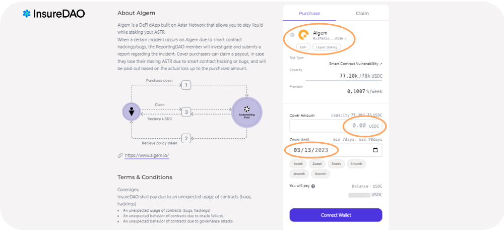

# 🐚 Insurance for Algem users

Algem has decided to partner with InsureDAO, the leading insurance protocol on the Astar network, to protect against the risks of hacking by offering an insurance policy for user funds.

_The policy enables anyone to create an insurance market for their DeFi protocol & ensure its security._

_You can now purchase insurance for your staking position on Algem and protect it against smart contract vulnerabilities._

Here are some of the **benefits** for you that InsureDAO provides.

* **Simple user interface and user experience;**
* **Affordable cost of insurance;**
* **This is the first-ever insurance protocol on top of Astar Network**

### **Insurance Pool Details**

1. Algem’s initial coverage will be $80k. This means Algem users can cover up to $80K’s worth of their staked assets. The higher the coverage sum, the higher the insurance cost.
2. The coverage duration is 3 months.
3. This is a part of the 300K index pool for all Astar Network DeFi projects available on InsureDAO.

### How To Use InsureDAO In 7 Steps

1. Step 1: Go to [InsureDAO dApp](https://staging.insuredao.fi/astar)
2. Step 2: Connect your EVM wallet to InsureDAO using the Astar Network RPC;
3. Step 3: Select the [protocol insurance](https://staging.insuredao.fi/astar/covers/0x37D65A2f66d022b3F1739dEDcA1DfA076526D53E) that you want to purchase (Algem);
4. Step 4: Enter the amount and the period to be covered; the _minimum cover period is 7 days and the maximum cover period is 90 days._
5. _Step 5. Check the cost of_ the insurance
6. Step 6: Approve USDC
7. Step 7: Confirm by clicking on “Purchase Insurance” and signing the transaction in your wallet

<figure><figcaption></figcaption></figure>

### How to redeem your insurance in case of a hack

If the Algem protocol, which you purchased insurance for, got hacked, you need to redeem your insurance from the dashboard of InsureDAO.

Once a payment decision pertaining to the incident is approved, insurance holders can redeem their insurance.

**You need to claim your insurance payout within 7 days of execution.**

Find out more about InsureDAO in their [documentation](https://insuredao.gitbook.io/insuredao/).
