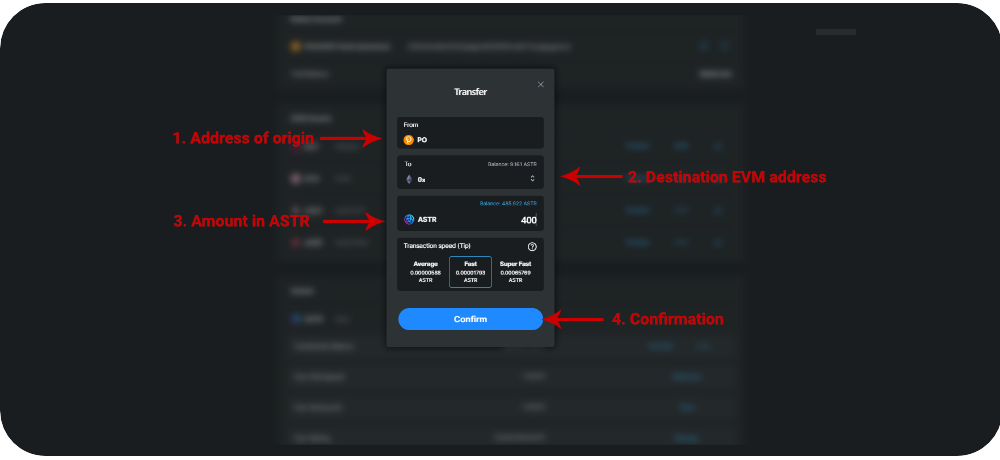

# 🏦 From a CEX

The Astar blockchain is divided into two chains: Substrate (**Native**) and Ethereum compatible (**EVM**).

One supports wallets like [**polkadot.js**](https://polkadot.js.org/extension/), [Talisman](https://talisman.xyz/) (native) or [Subwallet](https://subwallet.app/) (native) and the other supports EVM wallets like[ Metamask](https://metamask.io/), [Talisman](https://talisman.xyz/) (EVM) or [Subwallet](https://subwallet.app/) (EVM). The role of the [Astar portal](https://portal.astar.network/#/assets) is to make the **link between these two chains** to transfer tokens, information or instructions.

The token of the Astar Network blockchain is the **ASTR**. It is listed on [many exchanges](https://coinmarketcap.com/currencies/astar/markets/) (CEX or DEX). Among the centralized exchanges are **Binance, Kraken, OKX, Huobi, MEXC, Kucoin, and Gate.io**.

If you want to send tokens from a centralized exchange (CEX) like Binance or Kraken to an EVM wallet, like Metamask, on the Astar EVM chain, you have two options:

* **CEX supports withdrawals to the Astar EVM chain**
* **CEX does not support withdrawals to the Astar EVM chain, only to the Astar Native chain.**

_**Be careful, when you try a transfer for the first time, always test a first transaction with a small amount before sending all your funds!**_

### Sending ASTR from a CEX to Metamask using the Astar EVM network.

At the moment, only 2 CEX support withdrawals directly to the Astar EVM network: **Gate and MEXC**.

1. To make a withdrawal, go to the "withdraw" section of your CEX (Gate or MEXC).
2. Select the ASTR token and choose the **Astar network EVM;**
3. Enter your EVM address where you want to receive your tokens (Metamask);
4. Choose the amount of ASTR you want to withdraw;
5. Confirm the withdrawal;
6. After a certain period of time defined by the CEX, your tokens will arrive directly in your EVM wallet.

<figure><figcaption></figcaption></figure>

### Sending ASTR from a CEX to Metamask that does not support the Astar EVM network.

Most of the CEX mentioned above do not support the Astar EVM network, only the Astar Native network. To send tokens to Metamask, you will first have to send them to a native wallet (polkadot.js, Talisman or Subwallet) and then use the Astar Network portal to transfer them to your wallet on the Astar EVM network.

1. To withdraw, go to the "withdraw" section of your CEX;
2. Select the ASTR token and choose the **Astar Network**;
3. Enter your **native address** where you want to receive your tokens (Polkadot.js);
4. Choose the amount of ASTR you want to withdraw;
5. Confirm the withdrawal;
6. After a certain period of time defined by the CEX, your tokens will arrive directly in your native wallet;

<figure><figcaption></figcaption></figure>

7\. Once your tokens are in your native wallet, log in to the [Astar Network portal](https://portal.astar.network/#/assets);

8\. In the "Assets" section, click on the "Transfer" button on the ASTR token line;

<figure><figcaption></figcaption></figure>

9\. A window will open;

10\. Enter your **EVM address** copied from Metmask and choose the amount of ASTR you want to send;

11\. Confirm and sign the transaction in your wallet extension;

<figure><figcaption></figcaption></figure>

12\. After validation of the transaction on the blockchain, your tokens will be in your EVM wallet.

More information in the Astar Network documentation:


