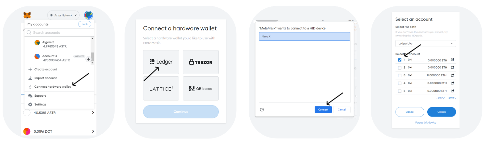
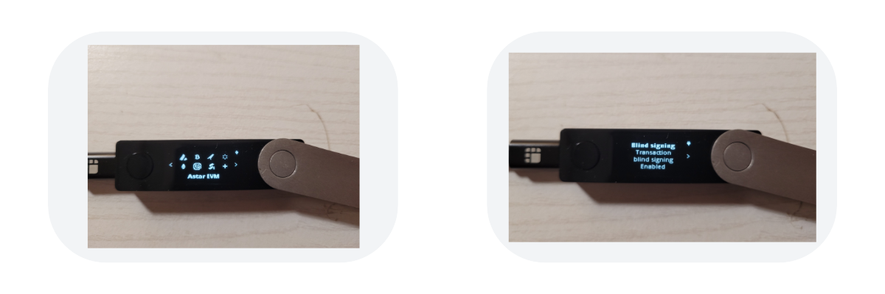
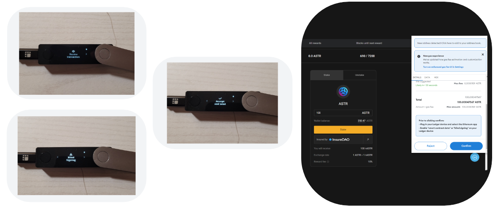
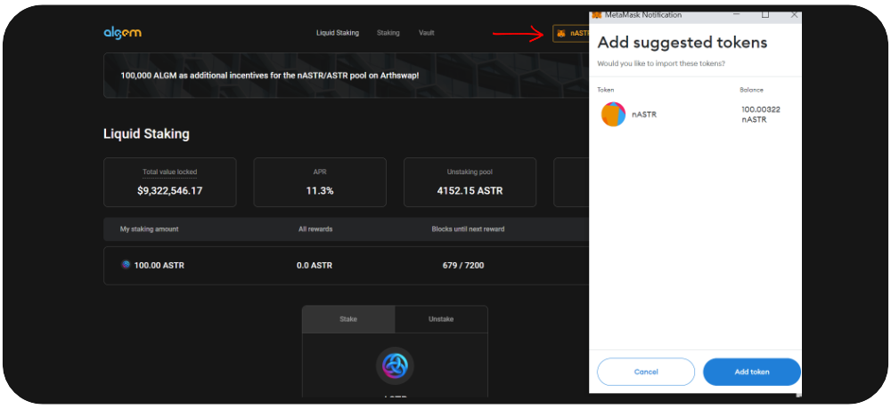

# 🔑 Ledger EVM

**Astar EVM** app is available on Ledger hardware wallet devices. This means that MetaMask users can now sign transactions for EVM accounts on those networks using Ledger Nano S (plus) or Ledger X devices. You can use your Ledger device to secure your ASTR tokens while using them on Algem protocol.&#x20;

## Requirements:

### A Ledger device ready to use

* [Make sure you have set up your Ledger device](https://support.ledger.com/hc/en-us/articles/360000613793?docs=true)
* Update your device to latest firmware
  * [Nano S](https://support.ledger.com/hc/en-us/articles/360002731113?docs=true)
  * [Nano S Plus](https://support.ledger.com/hc/en-us/articles/4445777839901?docs=true)
  * [Nano X](https://support.ledger.com/hc/en-us/articles/360013349800?docs=true)
* [Download and install Ledger Live app for your OS](https://support.ledger.com/hc/en-us/articles/4404389606417-Download-and-install-Ledger-Live?docs=true)
* [Download and install MetaMask for your browser](https://metamask.io/download/)

### Astar network set up on Metamask

When you connect Metamask to Algem dApp, Algem will automatically change the Metamask configuration to Astar Network. Still, if you need to add the network manually, you can find the configuration below.

1. Network name: `Astar Network Mainnet`
2. New RPC URL: \
   `https://astar.public.blastapi.io/`\
   `https://astar-rpc.dwellir.com/`\
   `https://astar.api.onfinality.io/public>]`
3. Chain ID: `592`
4. Currency Symbol: `ASTR`
5. Block Explorer URL(Optional): `https://astar.subscan.io/`

### Install Astar EVM app to your Ledger device

1. Open Ledger Live app and navigate to “Manager”
2. Connect your Ledger Device and unlock it
   1. If asked, confirm Ledger Manager on your device
3. Search for “Astar EVM” in the app catalog
4. Click install

<figure><figcaption></figcaption></figure>

## **Connecting your Ledger device to MetaMask**

1. In MetaMask menu select “Connect Hardware wallet:
2. On the next screen select “Ledger” and click “Continue
3. Pair and connect your Device when prompted by the browser:
4. Select an account you wish to connect and click “Unlock”

<figure><figcaption></figcaption></figure>

5\. You should now see your account and balance:

<figure><figcaption></figcaption></figure>

## Receiving tokens

To receive tokens, copy the address of your connected account by clicking your account name in MetaMask header, and send some tokens to that address from your preferred source.

## Sending tokens

1. Connect your Ledger device and unlock it and open Astar EVM app.
2. In MetaMask click “Send” button and enter the address you wish to send to
3. Enter the amount to send and click “Next”

<figure><figcaption></figcaption></figure>

4\. When your Ledger device screen is showing “Application is ready”, click “Confirm” in MetaMask

5\. Review the transaction on your Ledger device:

1. Check amount
2. Check receiving address
3. Check network
4. Check fees
5. Either approve or reject the transaction

6\. Check the transaction result in MetaMask “Activity” tab.

## **Interacting with smart contracts**

In order to interact with smart contracts, you need to enable blind signing in the Astar EVM app on your Ledger device:

1. Open the app
2. Navigate to “Settings” and confirm
3. Confirm the “Blind signing” option, so it turns to “Enabled”
4. Navigate to “Back” and confirm

<figure><figcaption></figcaption></figure>

## Use your Ledger EVM on Algem

In our example, we will see how to stake ASTR tokens on Algem with a ledger device.

Once you have configured your ledger, enabled smart-contracts and connected it to Metamask, you can connect your EVM ledger using Metamask to Algem dApp.

It will work the same way as a normal Metamask wallet but you will need to confirm every action and transaction on your ledger device.

<figure><figcaption></figcaption></figure>

1. Enter the amount of ASTR token you would like to stake (minimum of 100 ASTR);
2. Confirm your action by clicking on the stake button.
3. Sign the transaction in your Metamask-Legder wallet.
4. Confirm the transaction on your ledger device
   1. Blind Signing
   2. Check amount
   3. Check address (smart-contract)
   4. Check fees
   5. Approve the transaction

<figure><figcaption></figcaption></figure>

Once Algem has delegated your ASTR tokens to Astar dApp Staking, you will receive the same amount as the amount deposited in nASTR tokens and start earning staking rewards directly on your ledger address.

You can add the nASTR token to Metamask by adding the following token address or using the dedicated feature in Algem dApp.

_**nASTR:**_ 0xE511ED88575C57767BAfb72BfD10775413E3F2b0

<figure><figcaption></figcaption></figure>

To use your nASTR tokens in Algem's nASTR Liquidity Hub, please choose one of the different projects available and follow the corresponding guide. The only difference will be to confirm each transaction using your ledger device as explained above.
