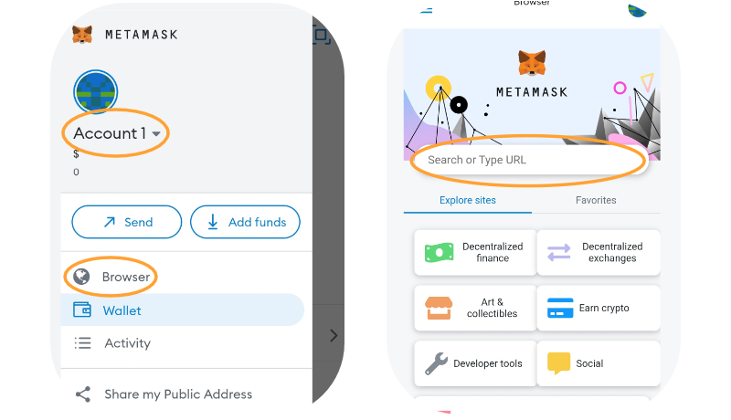

# 📱 Version mobile

Pour accéder à Algem via votre téléphone, nous vous recommandons d'utiliser l'application mobile Metamask disponible sur OS ou Android. Méfiez-vous des faux Metamask et utilisez uniquement le site officiel ! -> [https://metamask.io/](https://metamask.io/)

### Guide:

Une fois que votre portefeuille est connecté à Metamask mobile et que vous disposez de jetons ASTR, vous pouvez accéder au navigateur et rechercher [Algem.io](http://algem.io);

<figure><figcaption></figcaption></figure>

### Comment déposer vos jetons:&#x20;

* Entrez le montant de jetons ASTR que vous souhaitez déposer (minimum de 100 ASTR)
* Ensuite sélectionnez la dApp;
* Et confirmez votre action en cliquant sur le bouton déposer.
* Recevez une quantité égale de jetons nASTR et commencez à gagner des récompenses de staking.
* Utilisez les jetons nASTR pour farmer sur les dApps DeFi de nos partenaires dans la section de [nASTR Farming](../comment-utiliser-le-nastr-farming-dalgem/);

Une fois qu'Algem a délégué vos tokens ASTR au dApp Staking d'Astar, vous recevrez le même montant que le montant déposé en tokens nASTR et commencerez à gagner des récompenses de staking.

Vous pouvez ajouter le jeton nASTR à Metamask en ajoutant l'adresse suivante du jeton ou en utilisant la fonctionnalité dédiée dans Algem dApp.

_**nASTR**_: 0xE511ED88575C57767BAfb72BfD10775413E3F2b0

<figure><figcaption></figcaption></figure>

### Comment réclamer les récompenses:

* Pour réclamer vos récompenses, vous devez d'abord attendre au moins 1 ère (\~24h sur le réseau Astar);
* Appuyez ensuite sur le bouton « réclamer » et confirmez la transaction ;
* Vos récompenses seront distribuées directement dans votre portefeuille.

.png>)

### Comment se désengager (unstaking) :

* Assurez-vous de réclamer toutes vos récompenses de staking avant de recupérer (unstake) vos jetons.
* Pour récupérer vos ASTR en échange des des jetons nASTR, vous devez d'abord passer en mode « Récupérer» ;
* Entrez le montant nASTR que vous souhaitez retirer de la dApp sélectionnée ;
* Vous pouvez retirer vos jetons d'une ou de plusieurs ou même de toutes les dApps en même temps.
* Sélectionnez les [paramètres de désengagement](../../le-protocole-algem/liquid-dapp-staking/unstaking-nastr-recuperer-ses-astr.md) (classique ou immédiat) et acceptez les conditions ;
* Confirmez votre action en cliquant sur le bouton "désengager".

Vous recevrez vos jetons ASTR directement dans votre portefeuille après avoir rempli les conditions de désengagement (par exemple, la période de désengagement).

<figure><figcaption></figcaption></figure>
