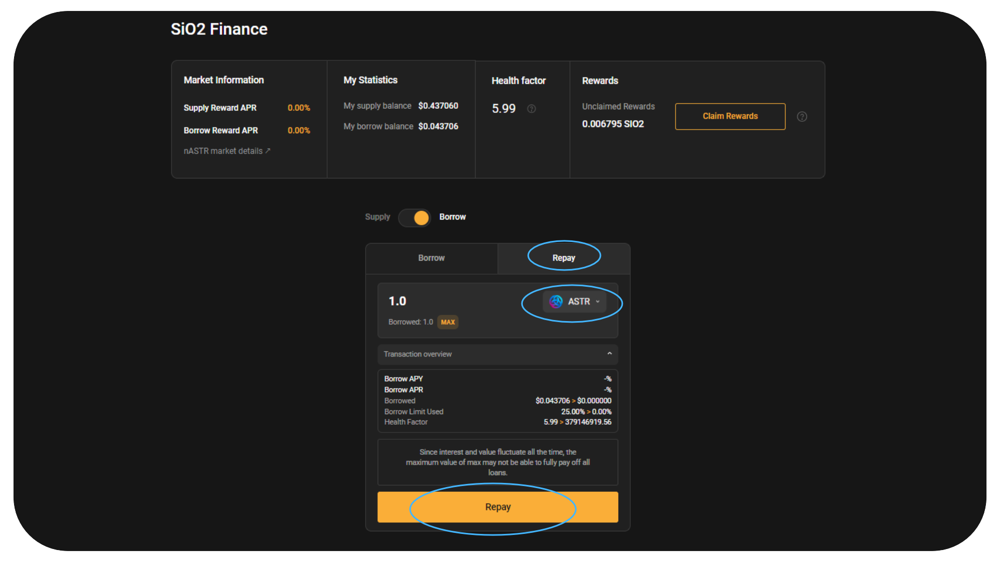
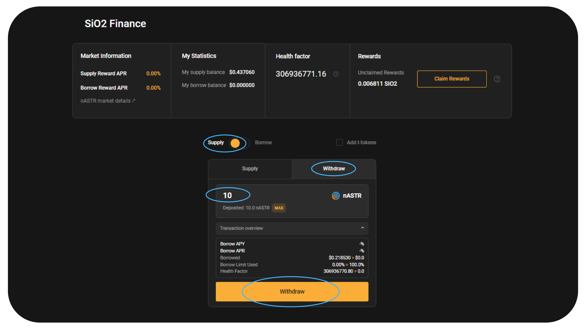

# 🍋 SiO2 Finance

[SiO2 Finance](https://www.sio2.finance/) is the multi-VM lending hub on Astar for Polkadot. They aim to become the best lending product with excellent user experience, easy-to-use one-click features, and transparent governance.

Algem’s nASTR Farming is now supporting SiO2 Finance. nASTR holders can lend their tokens as collateral to borrow other assets available on the lending platform such as ASTR, DOT, USDT, USDC, WBTC, WETH, etc.

## How to supply your nASTR and borrow on SiO2 Finance

Once you have staked ASTR tokens on [algem.io](http://algem.io/) and received nASTR tokens, select SiO2 Finance in the nASTR farming.

**⚠️ Warning: Before borrowing other assets on SiO2, be sure to understand** [**the concept of Health Factor, Borrowing limit and liquidation using a lending plateform.**](https://docs.algem.io/get-started/how-to-use-algems-nastr-farming/sio2-finance#be-aware-of-risks) **⚠️**

From the launch of the adapter, only the ASTR token can be borrowed for the first few weeks, to avoid the risk of liquidation while Algem users familiarize themselves with the concept of the lending platform.

### **nASTR Market Details:**

**Loan to Value : 40%** - You can borrow up to 40% of your nASTR Collateral Value;

**Liquidation Threshold : 48%** -  If the borrowed value rises over 48% of the collateral, the position is collateral deficient.

_The liquidation threshold is typically higher than the LTV ratio. For example, if the liquidation threshold for an asset is 48%, and a borrower has borrowed to the maximum LTV of 40%, if the value of their collateral falls such that their loan now represents 48% or more of the value of their collateral, their collateral will be liquidated._

_Example: Suppose a user deposits 10000 ASTR worth $1000 as collateral. With an LTV ratio of 40%, they can borrow up to $400 worth of another asset. If the price of ASTR drops such that the value of their collateral falls to $833.33, their loan now represents 48% of the value of their collateral ($400/$833.33 = 48%). At this point, the platform will initiate liquidation of the borrower's collateral to repay the loan._

**Liquidation Penalty : 12.50%**

_The liquidation penalty is an additional charge that is applied when a borrower's collateral is liquidated. This serves as a deterrent to borrowing more than can be safely repaid, and provides additional security to lenders._

_The liquidation penalty is added to the amount the borrower owes at the time of liquidation. The borrower's collateral is sold off until the loan plus the liquidation penalty is repaid._

_Example: Using the same example, suppose there's a 12.5% liquidation penalty. If the borrower's loan of $500 is being liquidated, an additional $62.5 (12.5% of $500) is added to the amount they owe. Their collateral will be sold off until $562.5 is repaid._

### **How to Supply your liquidity:**

* Select the Supply option;
* Enter the amount of nASTR you want to supply;
* Confirm the action by clicking on “Deposit” and signing the transaction in your wallet.

<figure><figcaption></figcaption></figure>

**Option:** If you have already provided liquidity on SIO2 and received I-tokens, you can still deposit your I-tokens tokens on Algem Farming.

### **How to Borrow assets:**

* Click the Borrow option;
* Choose the token you want to borrow from the available list;
* Enter the amount;
* Check your borrowing limit and health factor;
* Confirm the action by clicking on “Borrow” and signing the transaction in your wallet.

<figure><figcaption></figcaption></figure>

### **How to Repay your debts:**

* Select the Borrow option and switch to Repay;
* Choose the token you want to repay from the borrowed list;
* Enter the amount you need to repay;

_The amount to be repaid is higher than the amount borrowed, as it includes interest on the loan._

* Check your borrowing limit and new health factor;
* Confirm the action by clicking on “Repay” and signing the transaction in your wallet.

<figure><figcaption></figcaption></figure>

### **How to Withdraw your liquidity:**

* Be sure to have claim all your farming rewards before withdrawing your liquidity;
* Select the Supply option and switch to Withdraw;
* Enter the amount of nASTR you want to withdraw;
* Check to see if your borrowing limit and health factor allow you to withdraw your deposited tokens;

_If not, you must first pay off some or all of your debts before you can withdraw your liquidity._

* Confirm the action by clicking on “Withdraw” and signing the transaction in your wallet.

<figure><figcaption></figcaption></figure>

### **How to increase your Health Factor:**

If your health factor is close to 1, you risk being liquidated, so it would be wise to increase it.

To increase your health factor, you can

* Repay your borrowing position;
* Supply more collateral (nASTR);

### **Claim your rewards from the nASTR Farming**

* Select the SiO2 Fiance dApp in the farming section;
* Click on the **“Claim rewards”** button and sign the transaction in your wallet;
* Your rewards will be distributed directly into your wallet

<figure><figcaption></figcaption></figure>

## A Defi strategy using Algem and Si02 Finance :

This is an example of a Defi strategy using SiO2 on Algem to maximize liquid dApp staking and earn more staking rewards with a set amount of ASTR tokens :

* Stake 1000 ASTR on Algem, receive 1000 nASTR;
* Lend 1000 nASTR on Si02 on Algem’s Farming;
* Borrow up to 500 ASTR;
* Stake again 500 ASTR on Algem and receive 500 nASTR;
* Collect your staking rewards;

From 1000 ASTR, you are now receive staking rewards of 1500 nASTR (1000 ASTR deposited + 500 ASTR borrowed).

<figure><figcaption></figcaption></figure>

## Be aware of risks!

Before using a Lending protocol like SiO2 Finance, be sure you are aware of the risks:

*   **Liquidation:** Similar to all forms of Defi lending, there exists a risk of borrower default in Defi lending. When a user engages in borrowing within a lending platform, their position becomes associated with a "health factor." This health factor (HF) serves as an indicator of the security level of a deposited position compared to the borrowed position. A higher HF signifies a more secure state for the assets deposited, reducing the likelihood of liquidation.

    In instances where the HF drops below 1, the assets held in deposit may be subjected to liquidation. Liquidation involves a process where a portion of the borrower's debt, up to a specified percentage (X %), is settled. This value, along with the applicable liquidation fee, is deducted from the user's available collateral. Subsequently, the liquidated debt amount is repaid. To prevent liquidation, it is crucial to maintain an HF exceeding 1.

    To consolidate the Health factor, users have the option of increasing their collateral or partially repaying the loan amount

    \
    &#x20;See more in [SiO2 Finance’s documentation](https://sio2-finance.gitbook.io/en/systems/risk-parameters).
* **Smart-contract risks.** SiO2 Finance is developed based on Aave V2 which is already [heavily audited](https://docs.aave.com/developers/v/2.0/security-and-audits). SiO2 has been also [audited by PeckShield](https://github.com/SiO2-Finance/contracts/tree/main/audits) but please keep in mind that security audits don’t completely eliminate risks. \
  Do not supply assets that you cannot afford to lose to SiO2 Finance as a lender.

## Smart-contracts:

<table><thead><tr><th width="264">Type</th><th>Contract address</th></tr></thead><tbody><tr><td>Sio2Adapter</td><td><a href="https://blockscout.com/astar/address/0xAB06472A169e9eA3147A722464631D10553E384D">0xAB06472A169e9eA3147A722464631D10553E384D</a></td></tr><tr><td>Sio2AdapterAssetManager</td><td><a href="https://blockscout.com/astar/address/0x57c9f22168f315D33E1270b617F32F7940B89D67">0x57c9f22168f315D33E1270b617F32F7940B89D67</a></td></tr><tr><td>Sio2AdapterData</td><td><a href="https://blockscout.com/astar/address/0x01Daa46901103aED46F86d8be5376c3e12E8bd8b">0x01Daa46901103aED46F86d8be5376c3e12E8bd8b</a></td></tr></tbody></table>
