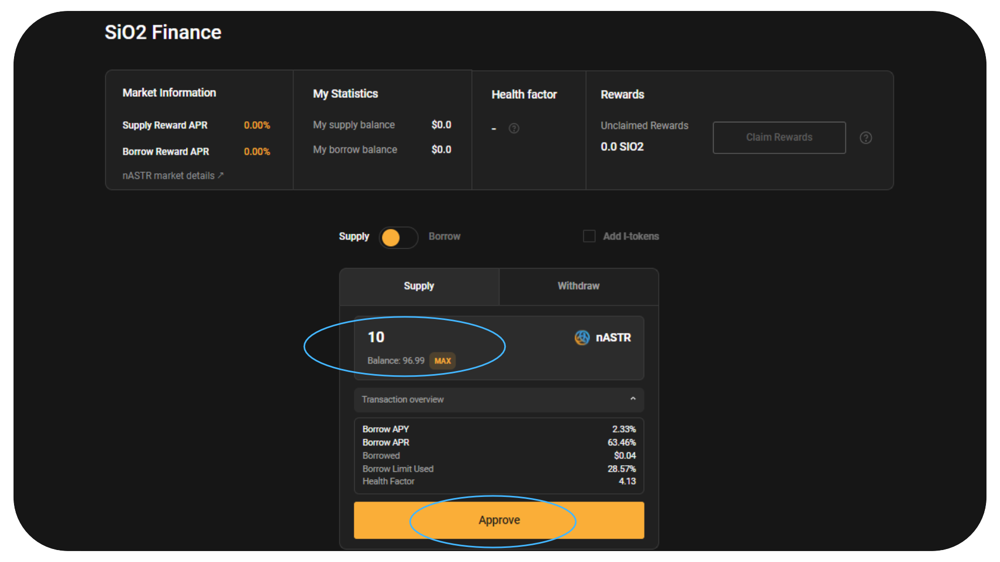

# 🍋 SiO2 Finance

[SiO2 Finance](https://www.sio2.finance/) est le hub de prêt multi-VM sur Astar pour Polkadot. Ils visent à devenir la meilleure plateforme de prêt avec une excellente expérience utilisateur, des fonctionnalités faciles à utiliser en un clic et une gouvernance transparente.

Algem nASTR Farming prend désormais en charge SiO2 Finance. Les détenteurs de nASTR peuvent prêter leurs jetons en garantie pour emprunter d'autres actifs disponibles sur la plateforme de prêt tels que ASTR, DOT, USDT, USDC, WBTC, WETH, etc.

## Comment déposer votre nASTR et emprunter sur SiO2 Finance

Une fois que vous avez déposé des jetons ASTR sur [algem.io](http://algem.io/) et reçu des jetons nASTR, sélectionnez SiO2 Finance dans nASTR Farming.

**⚠️ Attention : Avant d'emprunter d'autres actifs sur SiO2, assurez-vous de bien comprendre** [**les concepts de Facteur Santé, Limite d'emprunt et liquidation dans une plateforme de prêt.**](https://docs.algem.io/get-started/how-to-use-algems-nastr-farming/sio2-finance#be-aware-of-risks) **⚠️**

Lors du lancement de l'adaptateur, seul le token ASTR pourra être emprunté les premières semaines, pour éviter le risque de liquidation le temps que les utilisateurs d'Algem se familiarisent avec le concept de la plateforme de prêt.

### **Détails du marché nASTR:**

**Ratio prêt-valeur (LTV) : 40%** - Vous pouvez emprunter jusqu'à 40% de la valeur de votre garantie nASTR;

**Seuil de liquidation :** 48% - Si la valeur empruntée dépasse 48% de la garantie, le collatéral de la positon est insuffisant.

_Le seuil de liquidation est généralement supérieur au ratio prêt-valeur (LTV). Par exemple, si le seuil de liquidation d'un actif est de 48 % et qu'un emprunteur a emprunté jusqu'au LTV maximum de 40%, si la valeur de sa garantie chute de telle sorte que son prêt représente désormais 48% ou plus de la valeur de sa garantie, leur collateral sera liquidée._

_Exemple : supposons qu'un utilisateur dépose 10 000 ASTR d'une valeur de $1000 en garantie. Avec un ratio LTV de 40%, ils peuvent emprunter jusqu'à $400 d'un autre actif. Si le prix de l'ASTR baisse de telle sorte que la valeur de leur garantie tombe à 833,33 $, leur prêt représente désormais 48% de la valeur de leur garantie (400$ / 833,33$ = 48%). À ce stade, la plateforme initiera la liquidation du collatéral de l'emprunteur pour rembourser le prêt._

**Pénalité de liquidation : 12,50%**

_La pénalité de liquidation est une charge supplémentaire qui est appliquée lorsque la garantie d'un emprunteur est liquidée. Cela a pour effet de dissuader d'emprunter plus que ce qui peut être remboursé en toute sécurité et offre une sécurité supplémentaire aux prêteurs._

_La pénalité de liquidation s'ajoute au montant que l'emprunteur doit au moment de la liquidation. La garantie de l'emprunteur est vendue jusqu'au remboursement du prêt plus la pénalité de liquidation._

_Exemple : en utilisant le même exemple, supposons qu'il y ait une pénalité de liquidation de 12,5%. Si le prêt de 400$ de l'emprunteur est liquidé, un montant supplémentaire de 50$ (12,5% de 400$) est ajouté au montant qu'il doit. Leur collatéral sera vendue jusqu'à ce que 450$ soient remboursés._

### **Comment fournir vos liquidités :**

* Sélectionnez l'option Supply / Fournir;
* Entrez la quantité de nASTR que vous souhaitez fournir;
* Confirmez l'action en cliquant sur "Deposit / Déposer" et signez la transaction dans votre portefeuille.

<figure><figcaption></figcaption></figure>

**Option:** Si vous avez déjà fourni de la liquidité sur SIO2 et reçu des I-tokens, vous pouvez toujours déposer vos jetons I-tokens sur Algem Farming.

### **Comment emprunter des actifs :**

* Cliquez sur l'option Borrow / Emprunter;
* Choisissez le jeton que vous souhaitez emprunter dans la liste disponible;
* Entrez le montant;
* Vérifiez votre limite d'emprunt et votre facteur santé;
* Confirmez l'action en cliquant sur "Borrow / Emprunter" et signez la transaction dans votre portefeuille.

<figure><figcaption></figcaption></figure>

### **Comment rembourser vos dettes :**

* Sélectionnez l'option Borrow / Emprunter et passez à Repay / Rembourser;
* Choisissez le jeton que vous souhaitez rembourser dans la liste des emprunts;
* Saisissez le montant que vous devez rembourser;

_Le montant à rembourser est supérieur au montant emprunté, car il comprend les intérêts du prêt._

* Vérifiez votre limite d'emprunt et votre nouveau facteur de santé;
* Confirmez l'action en cliquant sur "Repay / Repayer" et signez la transaction dans votre portefeuille.

<figure><figcaption></figcaption></figure>

### **Comment retirer vos liquidités :**

* Assurez-vous d'avoir réclamé toutes vos récompenses de farming avant de retirer vos liquidités;
* Sélectionnez l'option Supply / Fournir et passez à Withdraw / Retrait;
* Entrez le montant de nASTR que vous souhaitez retirer;
* Vérifiez si votre limite d'emprunt et votre facteur santé vous permettent de retirer vos tokens déposés;

_Si ce n'est pas le cas, vous devez d'abord rembourser une partie ou la totalité de vos dettes avant de pouvoir retirer vos liquidités._

* Confirmez l'action en cliquant sur "Withdraw / Retirer" et signez la transaction dans votre portefeuille.

<figure><figcaption></figcaption></figure>

### **Comment augmenter votre facteur de santé :**

Si votre facteur de santé est proche de 1, vous risquez d'être liquidé, il serait donc judicieux de l'augmenter.

Pour augmenter votre facteur de santé, vous pouvez:

* Rembourser votre position emprunteur;
* Fournir plus de garanties (nASTR);

### **Réclamez vos récompenses de farming nASTR**

* Sélectionnez la dApp SiO2 Finance dans la section farming;
* Cliquez sur le bouton **"Claim rewards / Réclamer des récompenses"** et signez la transaction dans votre portefeuille;
* Vos récompenses seront distribuées directement dans votre portefeuille.

<figure><figcaption></figcaption></figure>

## Une stratégie Defi en utilisant Algem et Si02 Finance :

Ceci est un exemple de stratégie Defi utilisant SiO2 sur Algem pour maximiser le Liquid dApp staking et gagner plus de récompenses de staking avec un nombre défini de tokens ASTR :

* Déposez 1000 ASTR sur Algem, recevez 1000 nASTR;
* Prêtez 1000 nASTR sur Si02 sur Algem’s Farming;
* Empruntez jusqu'à 400 ASTR;
* Déposez de nouveau 400 ASTR sur Algem et recevez 400 nASTR ;
* Récupérez vos récompenses de staking;

À partir de 1000 ASTR, vous recevez désormais des récompenses de staking de 1400 nASTR (1000 ASTR déposés + 400 ASTR empruntés).

<figure><figcaption></figcaption></figure>

## Soyez conscient des risques !

Avant d'utiliser un protocole de prêt comme SiO2 Finance, assurez-vous d'être conscient des risques :

*   **Liquidation:** Comme tous types de prêts, les prêts Defi comportent le risque de défaillance de l'emprunteur. Lorsqu'un utilisateur emprunte sur une plateforme de prêt, un « facteur de santé » est associé à sa position. Le facteur de santé (HF) est un indicateur de la sécurité d'une position déposée par rapport à une position empruntée.

    Plus le HF est élevé, plus les actifs déposés sont à l'abri de la liquidation. Si le HF tombe en dessous de 1, les avoirs déposés peuvent être liquidés. Une liquidation est un processus dans lequel jusqu'à X % de la dette d'un emprunteur est remboursée, et cette valeur avec les frais de liquidation sont prélevés sur la garantie disponible de l'utilisateur. Après la liquidation, le montant liquidé de la dette est remboursé. Pour éviter la liquidation, assurez-vous que votre HF est supérieur à 1.

    Un utilisateur peut augmenter son HF en déposant plus d'actifs en garantie ou en remboursant une partie du prêt.

    \
    Voir plus dans la [documentation de SiO2 Finance](https://sio2-finance.gitbook.io/en/systems/risk-parameters).
* **Risques liés aux contrats intelligents.** SiO2 Finance est développé sur la base d'Aave V2 qui est déjà [fortement audité](https://docs.aave.com/developers/v/2.0/security-and-audits). SiO2 a également été [audité par PeckShield](https://github.com/SiO2-Finance/contracts/tree/main/audits), mais gardez à l'esprit que les audits de sécurité n'éliminent pas complètement les risques. Ne fournissez pas d'actifs que vous ne pouvez pas vous permettre de perdre sur SiO2 Finance en tant que prêteur. Ne fournissez pas d'actifs que vous ne pouvez pas vous permettre de perdre sur SiO2 Finance en tant que prêteur.

## Contracts intelligents:

<table><thead><tr><th width="264">Type</th><th>Addresse du contrat</th></tr></thead><tbody><tr><td>Sio2Adapter</td><td><a href="https://blockscout.com/astar/address/0xAB06472A169e9eA3147A722464631D10553E384D">0xAB06472A169e9eA3147A722464631D10553E384D</a></td></tr><tr><td>Sio2AdapterAssetManager</td><td><a href="https://blockscout.com/astar/address/0x57c9f22168f315D33E1270b617F32F7940B89D67">0x57c9f22168f315D33E1270b617F32F7940B89D67</a></td></tr><tr><td>Sio2AdapterData</td><td><a href="https://blockscout.com/astar/address/0x01Daa46901103aED46F86d8be5376c3e12E8bd8b">0x01Daa46901103aED46F86d8be5376c3e12E8bd8b</a></td></tr></tbody></table>
