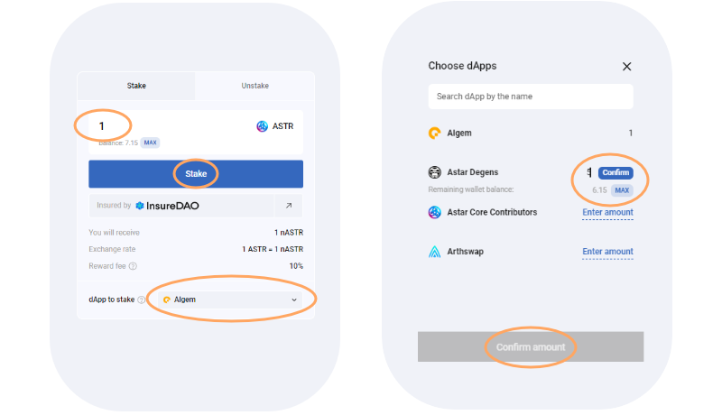

# 🖥 Versi desktop



## Ringkasan

**Total ASTR Staked** -> Jumlah total token ASTR distakingpada Protokol Algem\
**APR** -> jumlah nASTR di dompet pengguna, termasuk token dasar, token Lp, atau token agunan\
**Unstaking pool** -> token ASTR tersedia untuk unstaking segera\
**My Staking amount** -> jumlah nASTR di dompet pengguna, termasuk token dasar, token Lp, atau token agunan\
**All Rewards** -> Hadiah staking untuk diklaim\
**Blocks until next reward** -> Blok yang tersisa hingga era berikutnya dan oleh karena itu hingga distribusi hadiah berikutnya di kumpulan hadiah pengguna.

## Panduan :

Setelah Anda memiliki token ASTR di dompet EVM Anda, Anda dapat pergi ke bagian liquid staking di Algem dApp dan menghubungkan dompet EVM Anda.

### Bagaimana caranya Stake :&#x20;

* Masukkan jumlah token ASTR yang ingin Anda setorkan, (minimal 100 ASTR);
* Kemudian pilih dApp;
* Konfirmasikan tindakan Anda dengan mengklik tombol stake;
* Terima jumlah token nASTR yang sama dan mulailah mendapatkan hadiah staking;
* Gunakan token nASTR untuk bertani di mitra kami Defi dApps di [Pertanian nASTR](../cara-menggunakan-nastr-farming-algem/) kami;

Setelah Algem mendelegasikan token ASTR Anda ke Astar dApp Staking, Anda akan menerima jumlah yang sama dengan jumlah yang disimpan di token nASTR dan mulai mendapatkan hadiah staking.

Anda dapat menambahkan token nASTR ke Metamask dengan menambahkan alamat token berikut atau menggunakan fitur khusus di Algem dApp.

_**nASTR:**_ 0xE511ED88575C57767BAfb72BfD10775413E3F2b0

### Cara Klaim:**:**

* Untuk mengklaim hadiah, Anda harus menunggu minimal 1 era (\~24 jam di jaringan Astar);
* Kemudian tekan tombol “klaim” dan konfirmasi transaksi;
* Hadiah Anda akan didistribusikan langsung ke dompet Anda.

### Cara Unstake**:**

* Pastikan untuk mengklaim semua hadiah staking Anda sebelum meng-unstaking token Anda.
* Untuk menghapus token nASTR Anda dan menukarkan token ASTR, Anda harus terlebih dahulu beralih ke mode "unstake";
* Anda dapat melakukan unstake dari satu, beberapa, atau semua dApps secara bersamaan.
* Anda dapat melakukan unstake dari satu, beberapa, atau semua dApps secara bersamaan.
* Pilih parameter yang tidak [distaking](../../protokol-algem/liquid-dapp-staking/unstaking-nastr.md) (reguler atau langsung) dan terima ketentuannya;
* Konfirmasikan tindakan Anda dengan mengeklik tombol “unstake”.

Anda akan menerima token ASTR Anda langsung ke dompet Anda setelah memenuhi persyaratan unstaking (misalnya periode unbonding).

