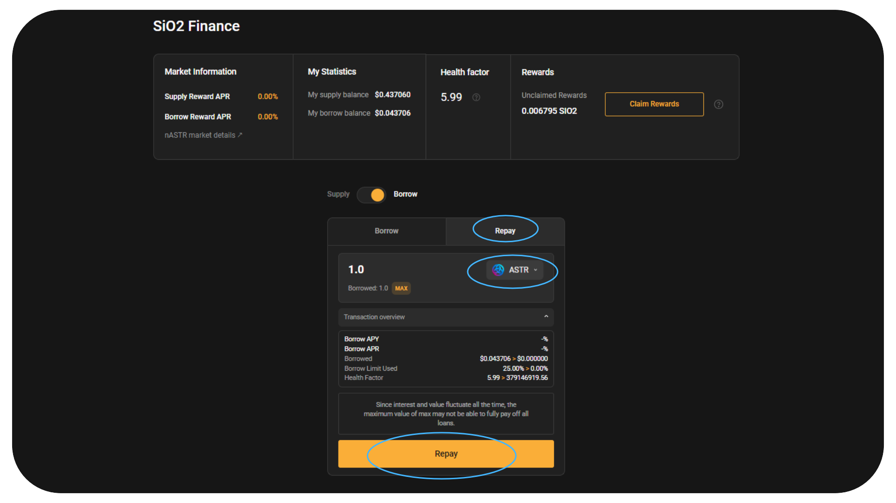

# 🍋 SiO2 Finance

[SiO2 Finance](https://www.sio2.finance/) adalah pusat peminjaman multi-VM di Astar untuk Polkadot. Mereka bertujuan untuk menjadi produk pinjaman terbaik dengan pengalaman pengguna yang luar biasa, fitur sekali klik yang mudah digunakan, dan tata kelola yang transparan.

Pertanian nASTR Algem sekarang mendukung Keuangan SiO2. Pemegang nASTR dapat meminjamkan token mereka sebagai jaminan untuk meminjam aset lain yang tersedia di platform peminjaman seperti ASTR, DOT, USDT, USDC, WBTC, WETH, dll.

## Bagaimana cara memasok nASTR Anda dan meminjam di SiO2 Finance

Setelah Anda staking token ASTR di [algem.io](https://www.algem.io/) dan menerima token nASTR, pilih Keuangan SiO2 di pertanian nASTR.

⚠️ Peringatan: Sebelum meminjam aset lain di SiO2, pastikan untuk memahami [konsep Faktor Kesehatan, Batas Pinjaman dan likuidasi menggunakan platform peminjaman](https://docs.algem.io/get-started/how-to-use-algems-nastr-farming/sio2-finance#be-aware-of-risks) . ⚠️

Sejak peluncuran adaptor, hanya token ASTR yang dapat dipinjam selama beberapa minggu pertama, untuk menghindari risiko likuidasi sementara pengguna Algem membiasakan diri dengan konsep platform peminjaman.

### Detail Pasar nASTR:

**Pinjaman ke Nilai :** 40% - Anda dapat meminjam hingga 40% dari Nilai Jaminan nASTR Anda;

**Ambang Batas Likuidasi : 48%** - Jika nilai pinjaman meningkat melebihi 48% dari agunan, maka posisinya kekurangan agunan.

_Ambang likuidasi biasanya lebih tinggi dari rasio LTV. Misalnya, jika ambang likuidasi untuk suatu aset adalah 48%, dan peminjam telah meminjam hingga LTV maksimum 40%, jika nilai agunan mereka turun sehingga pinjaman mereka sekarang mewakili 48% atau lebih dari nilai agunan mereka. , agunan mereka akan dilikuidasi._

_Contoh: Misalkan pengguna menyetorkan 10.000 ASTR senilai $1.000 sebagai jaminan. Dengan rasio LTV 40%, mereka dapat meminjam aset lain senilai hingga $400. Jika harga ASTR turun sedemikian rupa sehingga nilai agunan mereka turun menjadi $833,33, pinjaman mereka sekarang mewakili 48% dari nilai agunan mereka ($400/$833,33 = 48%). Pada titik ini, platform akan memulai likuidasi jaminan peminjam untuk melunasi pinjaman._

**Denda Likuidasi : 12,50%**

_Hukuman likuidasi adalah biaya tambahan yang diterapkan saat agunan peminjam dilikuidasi. Ini berfungsi sebagai pencegah untuk meminjam lebih dari yang dapat dilunasi dengan aman, dan memberikan keamanan tambahan bagi pemberi pinjaman._

_Denda likuidasi ditambahkan ke jumlah utang peminjam pada saat likuidasi. Agunan peminjam dijual sampai pinjaman ditambah denda likuidasi dilunasi._

_Contoh: Dengan menggunakan contoh yang sama, misalkan ada penalti likuidasi 12,5%. Jika pinjaman peminjam sebesar $400 dicairkan, tambahan $50 (12,5% dari $400) ditambahkan ke jumlah hutang mereka. Agunan mereka akan dijual sampai $450 dilunasi._

### Cara Memasok likuiditas Anda:

* Pilih opsi Pasokan;
* Masukkan jumlah nASTR yang ingin Anda berikan;
* Konfirmasikan tindakan dengan mengklik "Deposit" dan menandatangani transaksi di dompet Anda.

<figure><figcaption></figcaption></figure>

Opsi: Jika Anda telah menyediakan likuiditas di SIO2 dan menerima token-I, Anda masih dapat menyimpan token-token Anda di Algem Farming.

### Cara Meminjam aset:

* Klik opsi Pinjam;
* Pilih token yang ingin Anda pinjam dari daftar yang tersedia;
* Masukkan jumlah;
* Periksa batas pinjaman dan faktor kesehatan Anda;
* Konfirmasikan tindakan dengan mengklik "Pinjam" dan menandatangani transaksi di dompet Anda.

<figure><figcaption></figcaption></figure>

### Cara Membayar Hutang Anda:

* Pilih opsi Pinjam dan alihkan ke Bayar;
* Pilih token yang ingin Anda bayar dari daftar pinjaman;
* Masukkan jumlah yang harus Anda bayar;

_Jumlah yang harus dibayar lebih tinggi dari jumlah yang dipinjam, karena termasuk bunga pinjaman_.

* Periksa batas pinjaman Anda dan faktor kesehatan baru;
* Konfirmasikan tindakan dengan mengklik "Bayar" dan menandatangani transaksi di dompet Anda.

<figure><figcaption></figcaption></figure>

### Cara Menarik likuiditas Anda:

* Pastikan untuk mengklaim semua hadiah pertanian Anda sebelum menarik likuiditas Anda;
* Pilih opsi Pasokan dan alihkan ke Penarikan;
* Masukkan jumlah nASTR yang ingin Anda tarik;
* Periksa untuk melihat apakah batas pinjaman dan faktor kesehatan Anda memungkinkan Anda untuk menarik token yang Anda setorkan;

_Jika tidak, Anda harus terlebih dahulu melunasi sebagian atau seluruh hutang Anda sebelum Anda dapat mencairkan likuiditas Anda._

* Konfirmasikan tindakan dengan mengklik "Tarik" dan menandatangani transaksi di dompet Anda.

<figure><figcaption></figcaption></figure>

### Cara meningkatkan Faktor Kesehatan Anda:

Jika faktor kesehatan Anda mendekati 1, Anda berisiko dilikuidasi, jadi sebaiknya tingkatkan.

Untuk meningkatkan faktor kesehatan Anda, Anda bisa

* Bayar kembali posisi pinjaman Anda;
* Berikan lebih banyak agunan (nASTR);

### Klaim hadiah Anda dari Pertanian nASTR

* Pilih dApp SiO2 Tunangan di bagian pertanian;
* Klik tombol "Klaim hadiah" dan tandatangani transaksi di dompet Anda;
* Hadiah Anda akan didistribusikan langsung ke dompet Anda

<figure><figcaption></figcaption></figure>

## Strategi Defi menggunakan Algem dan Si02 Finance :

Ini adalah contoh strategi Defi menggunakan SiO2 di Algem untuk memaksimalkan staking dApp cair dan mendapatkan lebih banyak hadiah staking dengan sejumlah token ASTR :

* Stake 1000 ASTR di Algem, terima 1000 nASTR;
* Pinjamkan 1000 nASTR pada Si02 di Pertanian Algem;
* Pinjam hingga 400 ASTR;
* Staking lagi 400 ASTR di Algem dan dapatkan 400 nASTR;
* Kumpulkan hadiah staking Anda;

Dari 1000 ASTR, Anda sekarang menerima hadiah staking sebesar 1400 nASTR (1000 ASTR disimpan + 400 ASTR dipinjam).

<figure><figcaption></figcaption></figure>

## Waspadai risiko!

Sebelum menggunakan protokol Peminjaman seperti SiO2 Finance, pastikan Anda mengetahui risikonya:

*   **Likuidasi:** Seperti semua jenis pinjaman, pinjaman Defi membawa risiko gagal bayar peminjam. Saat pengguna meminjam di platform peminjaman, "faktor kesehatan" dikaitkan dengan posisinya. Faktor kesehatan (HF) merupakan indikator keamanan posisi yang disimpan dibandingkan dengan posisi yang dipinjam. Semakin tinggi HF, semakin aman aset yang disimpan dari likuidasi.

    Jika HF turun di bawah 1, aset yang disimpan dapat dilikuidasi. Likuidasi adalah proses di mana hingga X% dari utang peminjam dilunasi, dan nilai ini + biaya likuidasi diambil dari agunan yang tersedia milik pengguna. Setelah likuidasi, jumlah utang yang dilikuidasi dilunasi. Untuk menghindari likuidasi, pastikan HF Anda lebih besar dari 1. Pengguna dapat meningkatkan HF-nya dengan menyetor lebih banyak aset agunan atau dengan membayar kembali sebagian pinjaman.

    To consolidate the Health factor, users have the option of increasing their collateral or partially repaying the loan amount

    \
    [Dokumentasi SiO2 Finance.](https://sio2-finance.gitbook.io/en/systems/risk-parameters)
* **Risiko kontrak pintar:** SiO2 Finance dikembangkan berdasarkan Aave V2 yang sudah[ banyak diaudit](https://docs.aave.com/developers/v/2.0/security-and-audits). SiO2 juga telah diaudit [oleh PeckShield](https://github.com/SiO2-Finance/contracts/tree/main/audits) , tetapi perlu diingat bahwa audit keamanan tidak sepenuhnya menghilangkan risiko. Jangan berikan aset yang Anda tidak mampu kehilangan kepada SiO2 Finance sebagai pemberi pinjaman.

## Kontrak pintar:

<table><thead><tr><th width="264">Jenis</th><th>Alamat Kontrak</th></tr></thead><tbody><tr><td>Sio2Adapter</td><td><a href="https://blockscout.com/astar/address/0xAB06472A169e9eA3147A722464631D10553E384D">0xAB06472A169e9eA3147A722464631D10553E384D</a></td></tr><tr><td>Sio2AdapterAssetManager</td><td><a href="https://blockscout.com/astar/address/0x57c9f22168f315D33E1270b617F32F7940B89D67">0x57c9f22168f315D33E1270b617F32F7940B89D67</a></td></tr><tr><td>Sio2AdapterData</td><td><a href="https://blockscout.com/astar/address/0x01Daa46901103aED46F86d8be5376c3e12E8bd8b">0x01Daa46901103aED46F86d8be5376c3e12E8bd8b</a></td></tr></tbody></table>
