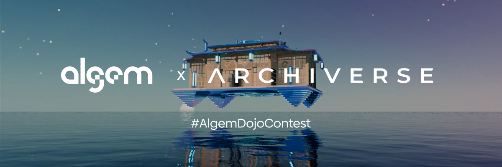

# 🖼 NFTコレクション

アルジェムはアスターネットワーク上で初のNFTとDeFiを組み合わせたプロジェクトです。NFTホルダーには手数料割引、高APR、プライベートアクセス、プレゼントなど様々な特典があります。

NFTは以下の3種類：

* Algemantis
* Liquid Staking Discount
* Algem x Archiverse Dojo

## Algemantis NFT コレクション

<figure><figcaption></figcaption></figure>

AlgemantisはアルジェムのメインNFTであり、アルジェムのセネター（上院議員）として、重要事項の決定権や早期プロダクトへのアクセス権などを有しています。

Algemantisのアイデアはアルジェム開発と同時に誕生しており、詳細はAlgemantisのウエブサイトで確認できます。

**NFT コントラクト名** : Algemantis Nautilus Pass \
**NFT コントラクトアドレス**: [0x170a3768117a9ae6939ea46c1b4265e94de44534 ](https://blockscout.com/astar/address/0x170a3768117A9Ae6939EA46c1b4265e94De44534)\
**発行枚数**: 246 ANP

### Algemantis NFTホルダーの特権

* リキッドレンディングの$ALGM報酬APR増加&#x20;
* リキッドレンディング手数料割引&#x20;
* プライベートNFTとトークンのエアドロップ&#x20;
* 限定の報酬付きコンテストや投票など&#x20;
* プライベートDiscordチャンネルへのアクセス&#x20;
* ガバナンスへの参加

Algemantis NFTは以下のサイトで売買可能です

[https://bluez.app/algemantis\_nautilus\_pass](https://bluez.app/algemantis\_nautilus\_pass)\
[https://tofunft.com/collection/algemantis-nautilus-pass/items](https://tofunft.com/collection/algemantis-nautilus-pass/items)

## Liquid Staking Discount NFT

<figure><figcaption></figcaption></figure>

Liquid Staking Discount NFTホルダーはリキッドdAppステーキング利用時の手数料が割引されます。

ホルダーは手数料10%に対して10%の割引が適用されるため、実質手数料が9%になります。複数所持による割引の重複はありません。

**NFT コントラクト名** :  Algem Liquid Staking Discount\
**NFT コントラクトアドレス**:[0xF0F9238013af5982f97A347D190181F200Ad68CD](https://blockscout.com/astar/token/0xF0F9238013af5982f97A347D190181F200Ad68CD/token-transfers)\
**発行枚数**: 66 ALSD

Liquid Staking Discount NFTは以下のサイトで売買可能です

[https://bluez.app/algem\_liquid\_staking\_discount](https://bluez.app/algem\_liquid\_staking\_discount)\
[https://tofunft.com/collection/algem-liquid-staking-discount/items](https://tofunft.com/collection/algem-liquid-staking-discount/items)

## Algem x Archiverse Dojo

<figure><figcaption></figcaption></figure>

このNFTは #AlgemDojoContest キャンペーンを完了したユーザーに配布されました。

DOJOはアルジェムとアスターネットワークのテーマカラーを参考に3Dモデル化されました。日本の伝統的な建築物をモチーフにネオ・フューチャリズムの要素を加えたオリジナルデザインに仕上げてあります。

道場内の空間は瞑想や鍛錬を行い、学びと楽しむ場所とされています。

このNFTは #AlgemDojoContestキャンペーンへ参加し、アスターエコシステムやアルジェムへの理解を深める様々なクエストを完了した証です。

DOJOはあなただけのものであり、自身の学びと成長を今後も思い出させてくれるでしょう。

_デザイン・制作： Archiverse (www.archiverse.art)_

**NFT コントラクト名** : Algem Dojo\
**NFT コントラクトアドレス:** [0xeBdA851087FF6A75961781987B9f1F7832D9DeB0](https://blockscout.com/astar/token/0xeBdA851087FF6A75961781987B9f1F7832D9DeB0/token-transfers)\
**発行枚数:** 160 AD

Algem x Archiverse Dojo NFTは以下のサイトで売買可能です

[https://bluez.app/algem\_dojo](https://bluez.app/algem\_dojo)\
[https://tofunft.com/collection/algem-archiverse-dojo/items](https://tofunft.com/collection/algem-archiverse-dojo/items)
