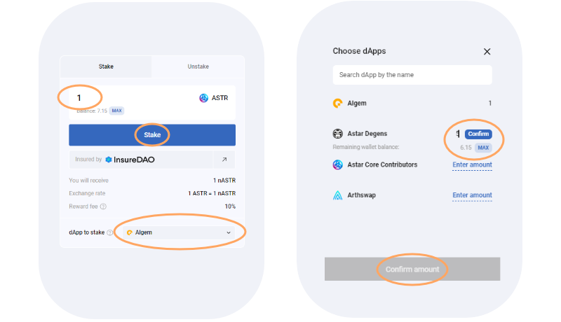
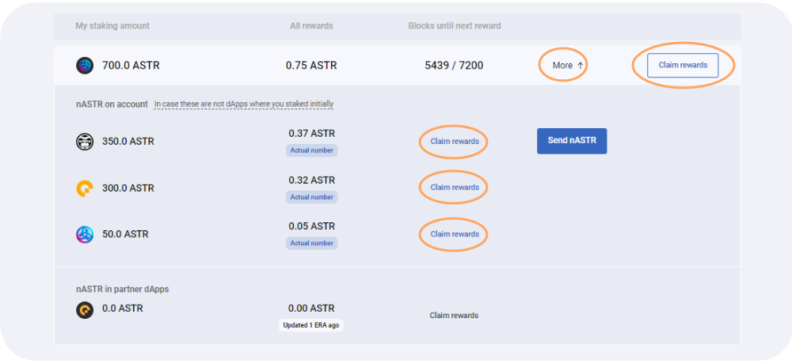

# 🖥 デスクトップ版



### 概要

Total ASTR Staked → Algem Protocolに賭けられたASTRトークンの合計額。\
APR→現在のdAppステーキングのAPRとAlgemのルールから算出される年率\
**Unstaking pool** -> すぐにアンステーキング可能なASTRトークン\
**My Staking amount** -> ベーシックトークン、Lpトークン、担保トークンを含むユーザーのウォレット内のnASTRの量\
**All Rewards** -> ステーキングリワードを請求する\
**Blocks until next reward** -> 次の時代まで、つまりユーザーの報酬プールの次の報酬分配まで残っているブロック。

## 案内します：

EVMウォレットにASTRトークンを入れたら、Algem dAppのリキッドステーキングセクションに行き、EVMウォレットを接続します。

### ステーキングの方法&#x20;

* 入金したいASTRトークンの量を入力します（最低100ASTRから）。
* 次にdAppを選択します；
* ステーキングボタンをクリックして行動を確認します。
* 同量のnASTRトークンを受け取り、ステーク報酬を獲得し始めます。
* nASTRトークンを使って、[nASTR Farming](../how-to-use-algems-nastr-farming/)のパートナーDefi dAppsで農業を行うことができます；

Algemがお客様のASTRトークンをAstar dApp Stakingに委任すると、nASTRトークンで入金された金額と同額を受け取り、ステーキング報酬の獲得を開始することができます。

nASTRトークンは、以下のトークンアドレスを追加するか、Algem dAppの専用機能を使ってMetamaskに追加することができます。

_**nASTR:**_ 0xE511ED88575C57767BAfb72BfD10775413E3F2b0

### 請求方法**:**

* 特典を受け取るには、まず1時間以上（Astar Networkでは24時間以上）待つ必要があります；
* その後、「請求」ボタンを押し、トランザクションを確認します；
* 報酬はあなたのウォレットに直接配布されます。

### アンステークする方法**:**

* トークンをアンステークする前に、必ずすべてのステーキングリワードを請求してください。
* nASTRトークンのアンステークとASTRトークンの交換を行うには、まず「アンステーク」モードに切り替える必要があります；
* 選択したdAppからアンステイクしたいnASTRの金額を入力します；
* つ、複数、またはすべてのdAppから同時にアンステークすることができます。
* アンステークパラメーター（[通常または即時](../../algem-protocol/liquid-dapp-staking/unstaking-nastr.md)）を選択し、条件を受け入れる；
* unstake」ボタンをクリックして、アクションを確認します。

アンステーク条件（アンボンディング期間など）を満たすと、ASTRトークンを直接ウォレットに受け取ることができます。

