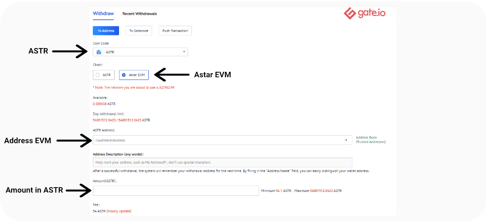
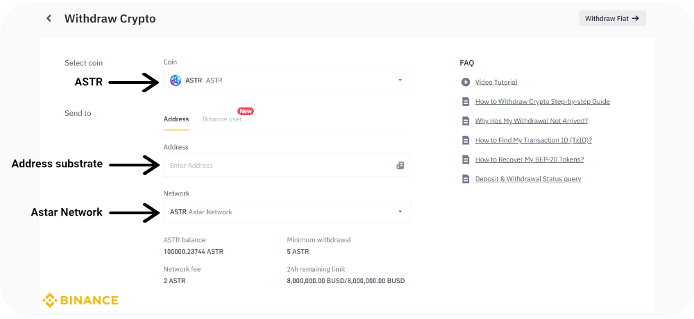
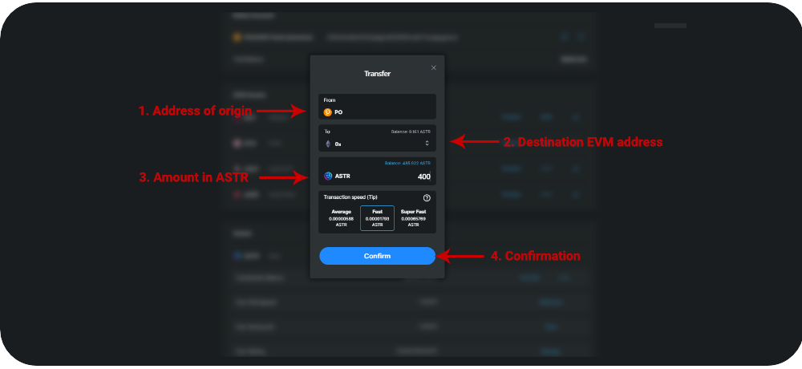

# 🏦 CEXからの送金方法

アスターネットワークは2つのチェーンで構成されています：サブストレイト(ネイティブ)とイーサリアム互換（EVM)

各ウォレットのサポート状況は、 ネイティブ：[Pokadot.js](https://polkadot.js.org/extension/)、[タリスマン](https://www.talisman.xyz/)、[サブウォレット](https://www.subwallet.app/) EVM：[メタマスク、](https://metamask.io/)[タリスマン、](https://www.talisman.xyz/)[サブウォレット](https://www.subwallet.app/) [アスターポータル](https://portal.astar.network/astar/assets#/assets)は２つのチェーンを繋ぎ、必要な情報やガイドを提供する役割があります。

アスターネットワークのネイティブトークンは$ASTRであり多く[の取引所](https://coinmarketcap.com/currencies/astar/)（CEX/DEX)に上場しています。主なCEXはBinance, Kraken, OKX, Huobi, MEXC, Kucoin, Gate.ioです。

BinanceやKrakenのようなCEXから$ASTRを送金する方法は以下の2通りとなります。

* ア**スターEVM対応のCEXから送金**&#x20;
* **アスターEVM非対応のCEXから送金**

_**注意：初めて送金を行う際は少額でテストすることをお勧めします。**_

### CEX（アスターEVM対応）からメタマスクへ＄ASTRを送金する方法

現在は**Gate.io**と**MEXC**のみアスターEVMに対応しています。

1. CEX (Gate or MEXC)で「出金」を選択&#x20;
2. トークンは$ASTR、ネットワークは **Astar network EVM** を選択&#x20;
3. 出金先のEVMアドレス（メタマスクなど）を入力&#x20;
4. 出金数量を入力&#x20;
5. 出金を承認&#x20;
6. ウォレットへ着金するまでしばらく待ちます"

<figure><figcaption></figcaption></figure>

### CEX（アスターEVM非対応）からメタマスクへ＄ASTRを送金する方法

多くのCEXはアスターネイティブにしか対応していません。そのためメタマスクなどへ出金する際は、ネイティブウォレット（Pokadot.js、タリスマン、サブウォレット）へ出金後、アスターポータル経由でアスターEVMへ送金します。

1. CEXで「出金」を選択&#x20;
2. トークンは$ASTR、ネットワークは**アスターネットワーク**を選択&#x20;
3. 出金先の**ネイティブアドレス**(Polkadot.jsなど)を入力 ;&#x20;
4. 出金数量を入力&#x20;
5. 出金を承認&#x20;
6. ウォレットへ着金するまでしばらく待ちます"

<figure><figcaption></figcaption></figure>

7. ウォレットへ着金後[アスターポー](https://portal.astar.network/astar/assets#/assets)タルへ接続&#x20;
8. "Assets""セクションで$ASTR欄の""Transfer""をクリック"

<figure><figcaption></figcaption></figure>

9. &#x20;”Transfer Assets""ページへ移動&#x20;
10. 送金先の**EVMアドレス**（メタマスクなど）と送金数量を入力&#x20;
11. トランザクションをネイティブウォレットで承認"

<figure><figcaption></figcaption></figure>

12. トランザクション完了後、EVMウォレットへ着金します 詳細はアスターネットワークのドキュメントをご参照ください。"


