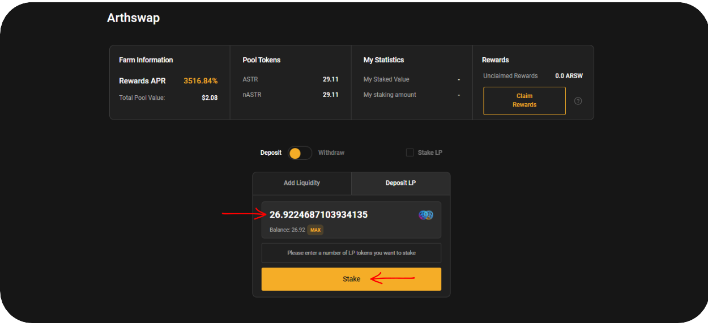
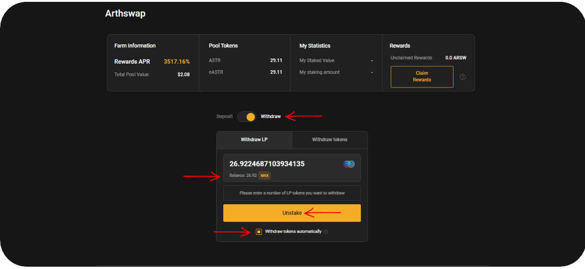
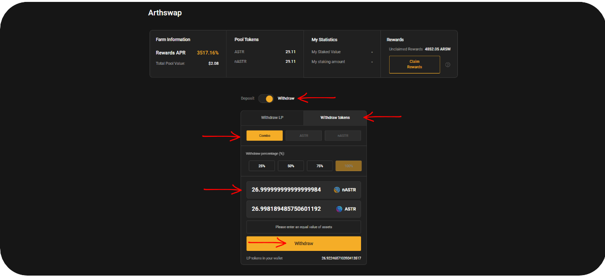
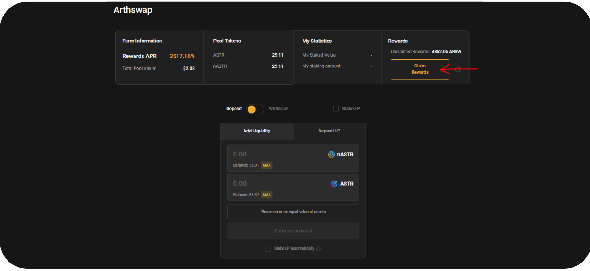

# 🥕 アーススワップ

シンプルなUIで高頻度取引が可能なDeFiプロジェクトであり、アスター上の主要DEXとなることを目指しています。主なサービスはトレード、ステーキング、IDOローンチパッド、流動性ファーミングであり、今後新しい機能も継続的に追加される予定です。



$nASTRファーミングではアーススワップもサポートしています。$nASTR:$ASTRプールへの流動性供給で得られるLPトークンをステーキングすることで、アーススワップから追加報酬を得ることが可能です。

### $nASTR:$ASTRファーミングのやり方

#### **流動性供給とLPステーキング**

* [アルジェム](https://www.algem.io/)で$ASTRをステーキングし$nASTRを入手後、カグラスファイナンスを選択し以下のガイドに従ってください。

<figure><figcaption></figcaption></figure>

* 入金方法を選択;&#x20;
* $nASTR又は$ASTRの数量を入力; 片側の数量を入力すると自動でペアトークンの数量が決定します&#x20;
* 同時にLPトークンをステーキングを選択;&#x20;
* 入金をクリックしウォレットで承認"

<figure><figcaption></figcaption></figure>

オプション：既にアーススワップで流動性供給やLPステーキングをされている方も、アルジェムでLPトークンやゴージトークンのステーキングが可能です。

<figure><figcaption></figcaption></figure>

#### LPトークンのアンステーキングと出金

* アンステーキングを行う前に必ず報酬のクレームを行う&#x20;
* アーススワップを選択&#x20;
* アンステークモードに切り替え&#x20;
* アンステークしたいLPトークンの数量を入力&#x20;
* トークンの同時引出を選択&#x20;
* アンステークをクリックしウォレットで承認"

<figure><figcaption></figcaption></figure>

<figure><figcaption></figcaption></figure>

#### **報酬のクレーム方法**

* "・アーススワップを選択&#x20;
* 「**報酬をクレーム**」をクリックしウォレットで承認&#x20;
* ウォレットに報酬が配布されます"

<figure><figcaption></figcaption></figure>

### リスクについて

アーススワップのようなDEXを利用する際は以下のようなリスクにご注意ください。

・インパーマネントロス & ペグ喪失. $nASTR:$ASTRの比率はマーケット状況やユーザーの利用状況（スワップ、売買等）に応じて変動しペグを喪失することがあります。プロジェクトを利用する前にコードを確認し、ペグ制資産を用いた流動性供給やAMM利用におけるリスクを確認することをお勧めします。詳細は[インパーマネントロス](https://finematics.com/impermanent-loss-explained/)をご参照ください。

・スマートコントラクトリスク. アーススワップは[Quantstamp](https://certificate.quantstamp.com/)の監査を受けていますが、監査で全てのリスクを取り除くことはできません。限度を超えた資産運用は行わないでください。

### スマートコントラクト

<table><thead><tr><th width="218">タイプ</th><th>コントラクトアドレス</th></tr></thead><tbody><tr><td>プール　コントラクト</td><td><a href="https://blockscout.com/astar/address/0xE915D2393a08a00c5A463053edD31bAe2199b9e7">0xE915D2393a08a00c5A463053edD31bAe2199b9e7</a></td></tr><tr><td>LP　コントラクト</td><td><a href="https://blockscout.com/astar/address/0xb4461721d3AD256CD59D207fEfBfE05791Ef8568">0xb4461721d3AD256CD59D207fEfBfE05791Ef8568</a></td></tr><tr><td>マスターシェフ</td><td><a href="https://blockscout.com/astar/address/0xc5b016c5597D298Fe9eD22922CE290A048aA5B75">0xc5b016c5597D298Fe9eD22922CE290A048aA5B75</a></td></tr></tbody></table>

