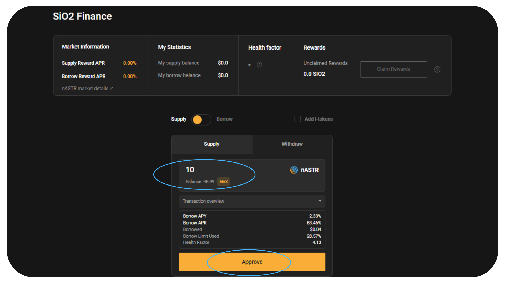
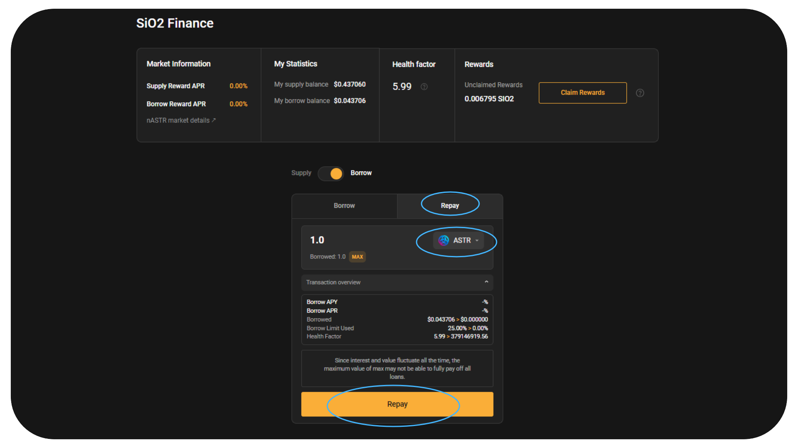

# 🍋 SiO2 Finance

[SiO2ファイナンス](https://www.sio2.finance/)はPolakadotのAstar上で展開しているマルチVM対応のレンディングハブです。ワンクリック機能や透明性の高いガバナンスなど優れたUXを提供し最高のレンディングプロトコルを目指しています。

Algemの$nASTRファーミングはSiO2ファイナンスをサポートしており、$ASTR, $DOT, $USDT, $USDC, $WBTC, $WETHなどのトークンを$nASTRを担保に借りることができます。

## $nASTRの供給とトークンの借り方

[Algem.io](https://www.algem.io/)へ$ASTRをステーキングし$nASTRを受領後、$nASTRファーミングからSiO2ファイナンスを選択

⚠️ 注意：SiO2でトークンを借りる前に[ヘルスファクター、借入限度、清算に関して理解しておいて下さい。](https://docs.algem.io/get-started/how-to-use-algems-nastr-farming/sio2-finance#be-aware-of-risks)⚠️

Algemユーザーが精算リスクについて理解を深めることができるように、adapterローンチ直後の数週間は$ASTRのみ借入可能です。

### $nASTRマーケット詳細：

**Loan to Value : 40%** - 担保である$nASTRの価値の40%まで借入可能

**Liquidation Threshold : 48%** - 借入額が担保の48%を超えてくると担保不足となります

清算限界はLTVより高いことが多いです。例として清算限界が48%の資産を最大LTVの40%まで借入している場合を想定します。担保価値の減少により借入額が担保価値の48%を上回った場合、担保の清算が行われます。

例：10,000ASTR ($1,000)を担保として預けた場合、LTV40%で最大$400のトークンを借入できます。$ASTRが下落し担保の価値が$833.33になるとLTVが48% (%400/$833.33 = 60%) に変化します。この時点で担保の清算が開始されます。

Liquidation Penalty : 12.50%

_清算ペナルティは精算時に借り手に課せられる追加手数料です。過度の借入を抑制し貸し手への保険の役割を持っています。_

_清算ペナルティは精算時の不足金額に追加されます。借り手の担保は不足金額の返済と清算ペナルティ分の支払を完了するまで清算されます。_

_例：10,000ASTR ($1,000)を担保として預け$400を借りた場合。清算ペナルティが12.5%とすると。$400が精算された場合追加で$50($400 x 12.5%) が不足金となり、担保から$540が精算されます。_

### 流動性の供給方法：

* Supplyを選択
* 供給したい$nASTRの数量を入力
* Depositをクリックしウォレットで承認

<figure><figcaption></figcaption></figure>

Option: 既にSiO2へ流動性を提供しlトークンを保持している場合もAlgemのファーミングに利用できます。

### トークンの借り方：

* Borrowをクリック
* 借りたいトークンをリストから選択
* 数量を入力
* 借入限度とヘルスファクターを確認
* Borrowをクリックしウォレットで承認

<figure><figcaption></figcaption></figure>

### 借金の返済方法：

* Borrowを選択しRepayに変更
* リストから返済したいトークンを選択
* 返済数量を入力

_利息があるため返済量は借入額より多くなります_

* 借入限度とヘルスファクターを確認
* Repayをクリックしウォレットで承認

<figure><figcaption></figcaption></figure>

### 流動性を引き出す方法

* ファーミング報酬の受取を確認
* Supplyを選択しWithdrawに変更
* 引き出したい$nASTRの数量を入力
* 借入限度とヘルスファクターを確認し引出可能か確認

_無理な場合は借金の一部又は全額を返済_

* Withdrawをクリックしウォレットで承認

<figure><figcaption></figcaption></figure>

### ヘルスファクターを増やす方法

ヘルスファクターが1に近づくと清算リスクが高まります

以下のようにヘルスファクターを増やすことが可能です

* 借入金の返済
* 担保 ($nASTR) の増加

### $nASTR Farming報酬の受取方法

* ファーミングセクションからSiO2ファイナンスを選択
* Claim rewardsをクリックしウォレットで承認
* 報酬はウォレットへ直接送付されます

<figure><figcaption></figcaption></figure>

## AlgemとSiO2ファイナンスを利用したDeFiストラテジー

SiO2とAlgemを利用しリキッドdAppsステーキングを最大限有効活用するストラテジーの例を紹介します。

* 1000ASTRをAlgemでステーキングし1000nASTRを受け取る
* Algemファーミングを通してSiO2に1000nASTRを供給
* 最大400ASTRを借入
* 400ASTRをAlgemでステーキングし400nASTRを受け取る
* ステーキング報酬を受け取る

元金1000ASTRから1400nASTR分のステーキング報酬を手に入れることができます (元金1000ASTR + 借入400ASTR)

<figure><figcaption></figcaption></figure>

## リスクに注意！

SiO2のようなレンディングプロトコル利用の際には以下のようなリスクにご注意ください：

*   **清算:** DeFiでの借入には債務不履行のリスクが伴います。トークン借入時はヘルスファクター (Health factor: HF) が重要です。HFは担保と借入額の指標であり数値が高いほど清算リスクが低くなります。

    HFが1以下になると担保の清算リスクが高まります。清算時はx%分の返済額と清算手数料が担保から支払われます。清算を避けるためにもHFは1以上を保ってください。担保の追加や借入金の返済によりHFを増やすことが可能です。

    \
    [詳細はSiO2](https://sio2-finance.gitbook.io/en/systems/risk-parameters)ファイナンスのドキュメントを参照ください。
* **スマートコントラクトリスク**. SiO2ファイナンスは[厳重に監査されている](https://docs.aave.com/developers/v/2.0/security-and-audits)Aave V2をベースに開発されています。SiO2も[PeckShieldによる監査](https://github.com/SiO2-Finance/contracts/tree/main/audits)を受けていますがリスクを完全に取り除けるわけではありません。余裕を持ってSiO2ファイナンスをご利用ください。

## スマートコントラクト:

<table><thead><tr><th width="264">Type</th><th>Contract address</th></tr></thead><tbody><tr><td>Sio2Adapter</td><td><a href="https://blockscout.com/astar/address/0xAB06472A169e9eA3147A722464631D10553E384D">0xAB06472A169e9eA3147A722464631D10553E384D</a></td></tr><tr><td>Sio2AdapterAssetManager</td><td><a href="https://blockscout.com/astar/address/0x57c9f22168f315D33E1270b617F32F7940B89D67">0x57c9f22168f315D33E1270b617F32F7940B89D67</a></td></tr><tr><td>Sio2AdapterData</td><td><a href="https://blockscout.com/astar/address/0x01Daa46901103aED46F86d8be5376c3e12E8bd8b">0x01Daa46901103aED46F86d8be5376c3e12E8bd8b</a></td></tr></tbody></table>
