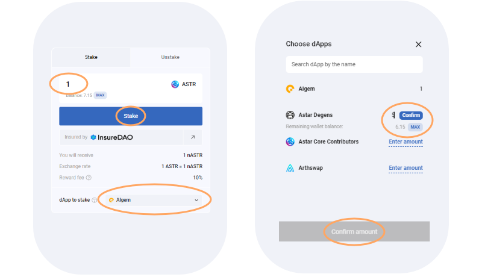

# 🖥 デスクトップでの利用方法



### 概要

**リキッドステーキング** \
**総ロック量** -> アルジェムに預けられた$ASTRの総量 \
**APR** -> dAppステーキングとアルジェムのルールにより算出されている年利 \
**アンステーキングプール** -> 即時アンステーキングに利用可能な$ASTRの数量 \
現在のERA \
**My Staking amount** -> ユーザーがウォレットに保有している$nASTRの数量（LPや担保トークン含む） \
**All Rewards** -> クレーム可能なステーキング報酬の数量 \
**Blocks until next reward** -> 次のERAまでのブロック数。次の報酬が配布されるまでの待期期間。"

## ガイド：

EVMウォレットに$ASTRを入金後、アルジェムのリキッドステーキングページへ移動しウォレットを接続します。

### ステーキングのやり方&#x20;

* 入金したい$ASTRの数量を入力(最低100ASTR)&#x20;
* dAppを選択；&#x20;
* ステークをクリックしウォレットで承認&#x20;
* 同量の$nASTRを受取、同時にステーキング報酬が発生&#x20;
* [nASTR ファーミング](../nastr-fminguno/)からパートナープロジェクトを選択し$nASTRを運用;"

アルジェムによってdAppステーキングが開始されると、ユーザーは同量の$nASTRを受取、同時にステーキング報酬が貯まり始めます。

メタマスクへ$nASTRなどのトークンを追加する場合、アルジェムのウエブサイトを利用すると自動で行えます。手動でトークンを追加する場合は以下のアドレスをご利用下さい。

_**nASTR:**_ 0xE511ED88575C57767BAfb72BfD10775413E3F2b0

### クレームのやり方

* 最初のクレームまで最低1ERA（約24時間）必要です&#x20;
* クレームをクリックしウォレットで承認&#x20;
* ウォレットに報酬が送付されます"

### アンステーキングのやり方

* アンステーキングを行う前に必ず報酬のクレームを行う&#x20;
* アンステークモードに切り替え&#x20;
* dAppを選択しアンステークしたい$nASTRの数量を入力&#x20;
* 複数のdAppsからの同時アンステーキングも可能&#x20;
* [アンステーキングパラメーター](../../algem-protocol/rikiddodappsutkingu/ansutkingu-nastr.md)（通常又は即時)を選択&#x20;
* アンステークをクリックしウォレットで承認"

アンボンディング期間満了後、ウォレットに$nASTRが送付されます。

