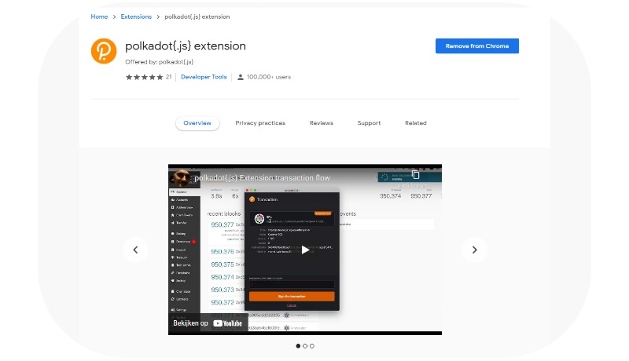
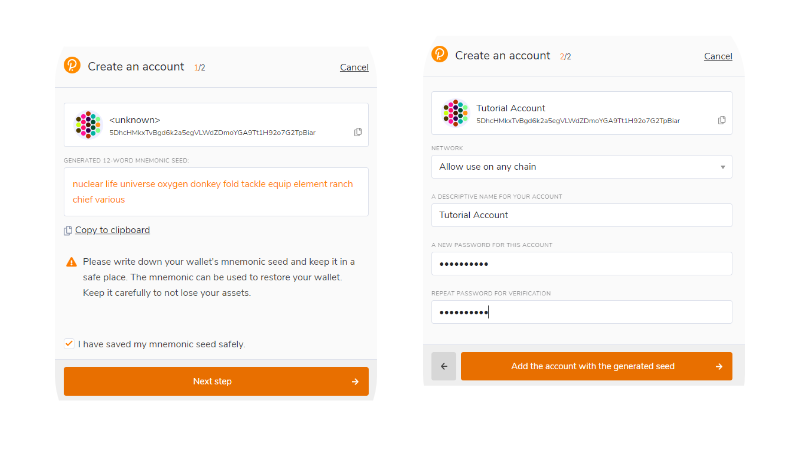

# \* Polkadot{.js}

### Polkadot.js プラグインをインストール

プラグインをインストール [Google Chrome](https://chrome.google.com/webstore/detail/polkadot%7Bjs%7D-extension/mopnmbcafieddcagagdcbnhejhlodfdd?hl=en) (chromiumベースのBraveなど）, [Firefox](https://addons.mozilla.org/en-US/firefox/addon/polkadot-js-extension/)\
\
インストールが完了すると、ブラウザ右上に白とオレンジのPokadotロゴが確認できます。

### Pokadot.jsウォレットを作成

Pokadot.jsを開き右上の+ボタンをクリックし"Create a new account"を選択

12文字のシードフレーズがランダム生成されます。シードフレーズのメモは安全に保管して下さい。

ウォレット名とパスワードを設定。パスワードは2回入力する必要があります。

ポルカドットネイティブなサブストレイト用のウォレットの完成です！
