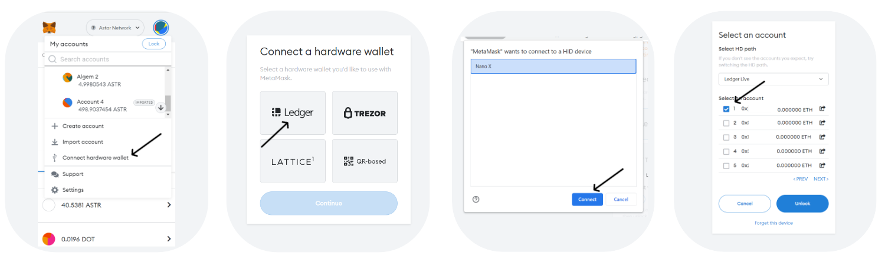
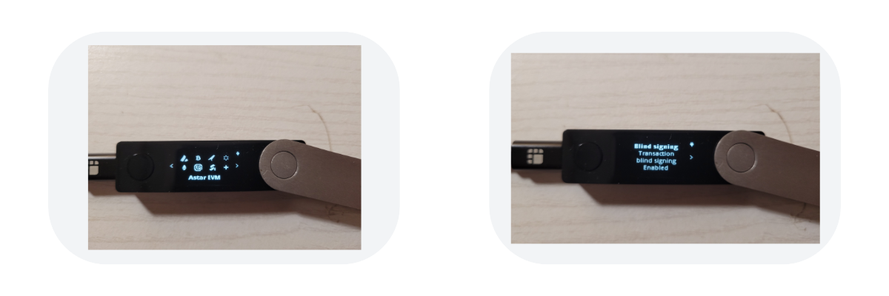
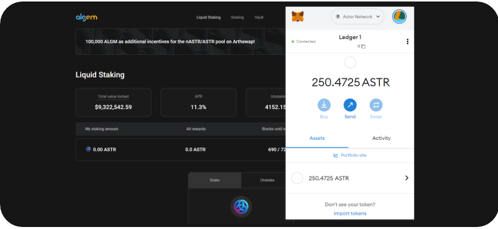
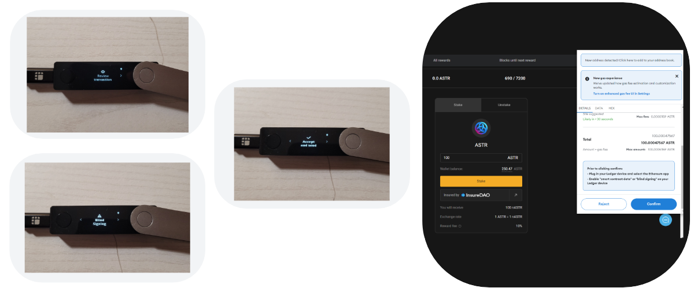
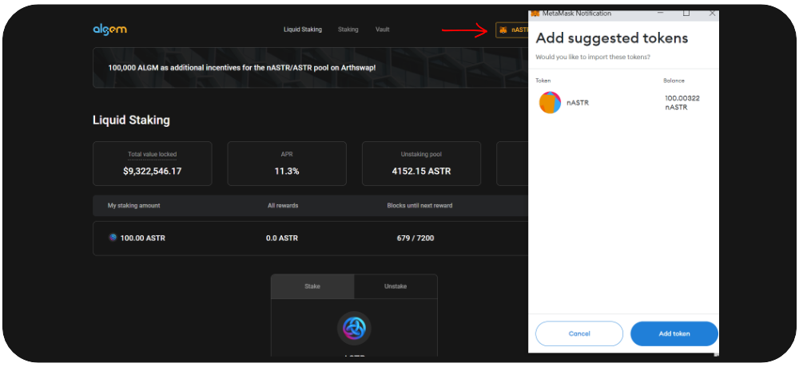

# 🔑 レジャーEVM

レジャーでアスターEVMアプリが利用可能です。メタマスクユーザーはEVMのトランザクションをレジャーナノS (Plus)やレジャーXでも承認できます。レジャーで$ASTRを安全に保管しつつアルジェムを利用することができます。

## 条件

### レジャーの使用方法

* [レジャーのセットアップを行う](https://support.ledger.com/hc/en-us/articles/360000613793?docs=true)
* ファームウェアをアップデート
  * [Nano S](https://support.ledger.com/hc/en-us/articles/360002731113?docs=true)
  * [Nano S Plus](https://support.ledger.com/hc/en-us/articles/4445777839901?docs=true)
  * [Nano X](https://support.ledger.com/hc/en-us/articles/360013349800?docs=true)
* [OSに合わせてレジャーライブアプリをダウンロード・インストール](https://support.ledger.com/hc/en-us/articles/4404389606417-Download-and-install-Ledger-Live?docs=true)
* [メタマスクをダウンロード・インストール](https://metamask.io/download/)

### メタマスクにアスターネットワークを追加

アルジェムへメタマスクを接続すると自動的にアスターネットワークが追加されます。手動でネットワークを追加される場合は以下の設定をご利用下さい。

1. ネットワーク名: `Astar Network Mainnet`
2. 新 RPC URL: \
   `https://astar.public.blastapi.io/`\
   `https://astar-rpc.dwellir.com/`\
   `https://astar.api.onfinality.io/public>]`
3. シンボル: ID: `592`
4. シンボル: `ASTR`
5. ブロックエクスプローラー: `https://astar.subscan.io/`

### アスターEVMアプリのインストール方法

1. レジャーライブアプリを開き”Manager""へ&#x20;
2. レジャーを接続しアンロック&#x20;
   1. 必要に応じてレジャーManagerで承認&#x20;
3. アスターEVMをアプリ一覧から検索&#x20;
4. インストール"

<figure><figcaption></figcaption></figure>

## レジャーとメタマスクの接続方法

1. メタマスクのメニューから「ハードウェアウォレットの接続」へ&#x20;
2. 「LEDGER」を選択し続行&#x20;
3. レジャーを接続&#x20;
4. 接続したいアカウントを選択しアンロック"

<figure><figcaption></figcaption></figure>

5\. アカウントと残高が表されます

<figure><figcaption></figcaption></figure>

## トークンの受け取り方

メタマスク上でアドレスをコピーし、送金したい口座からコピーしたアドレスへ送金します。

## トークンの送り方

1. レジャーを接続しアンロック後アスターEVMアプリを開く&#x20;
2. メタマスクで送金をクリックし送金先のアドレスを入力&#x20;
3. 送金数量を入力し次へ"

<figure><figcaption></figcaption></figure>

4. &#x20;レジャーで「アプリケーションの準備ができました」と表示されたらメタマスクで承認\

5.  レジャーでトランザクションを確認&#x20;

    1. &#x20;数量&#x20;
    2. 受取アドレス&#x20;
    3. ネットワーク&#x20;
    4. 手数料&#x20;
    5. トランザクションの承認又は拒否"

6. メタマスクのアクティビティタブでトランザクションを確認

## スマートコントラクトを扱う

スマートコントラクトを扱うためにはレジャーのアスターEVMアプリでブラインド署名を有効にする必要があります。

1. アプリを開く&#x20;
2. &#x20;設定を開き承認&#x20;
3. ブラインド署名を承認し有効化&#x20;
4. 戻るを選択し承認"

<figure><figcaption></figcaption></figure>

## アルジェムでレジャーEVMを利用する

レジャーを利用して$ASTRをステーキングする方法を紹介します。

レジャーのセットアップが完了したら、メタマスクを通してアルジェムとレジャーを接続できます。

基本的な使い方はメタマスクと同じですが、トランザクションの承認をレジャーで行います。

<figure><figcaption></figcaption></figure>

1. "ステーキングした＄ASTRの数量を入力（最低100ASTR）&#x20;
2. ステークをクリック&#x20;
3. メタマスク-レジャーでトランザクションを承認&#x20;
4. レジャーでトランザクションを承認"
   1. ブラインド署名&#x20;
   2. 数量&#x20;
   3. アドレス（スマートコントラクト）&#x20;
   4. 手数料&#x20;
   5. トランザクションの承認"

<figure><figcaption></figcaption></figure>

アルジェムを通してdAppステーキングが完了すると同量の$nASTRが発行され、同時にステーキング報酬が直接レジャーへ貯まり始めます。

メタマスクへ$nASTRなどのトークンを追加する場合、アルジェムのウエブサイトを利用すると自動で行えます。手動でトークンを追加する場合は以下のアドレスをご利用下さい。

_**nASTR:**_ 0xE511ED88575C57767BAfb72BfD10775413E3F2b0

<figure><figcaption></figcaption></figure>

アルジェムのnASTR流動性ハブで$nASTRを利用する際は、後に紹介するアルジェムのパートナープロジェクトご利用下さい。レジャーで利用する際はトランザクションの承認をレジャーで行います。
