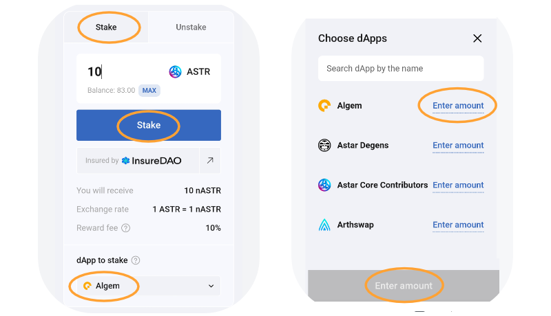

# 📱 Мобильная версия

Для доступа к Algem на вашем телефоне мы рекомендуем использовать мобильное приложение Metamask, доступное на OS или Android. Остерегайтесь поддельных Metamask и используйте только официальный сайт! ->[https://metamask.io/](https://metamask.io/)

### Гайд:

Как только ваш кошелек подключен к мобильному Metamask и у вас есть токены ASTR, вы можете перейти в браузер и найти [Algem.io](http://algem.io);

<figure><figcaption></figcaption></figure>

### Как застейкать:&#x20;

* Введите количество токенов ASTR, которое вы хотите внести (минимум 100 ASTR).
* Затем выберите dApp;
* Подтвердите свои действия, нажав на кнопку "Сделать ставку".
* Получите равное количество токенов nASTR и начните зарабатывать вознаграждения за ставки.
* Используйте токены nASTR для ведения хозяйства в Defi dApps наших партнеров в нашем [nASTR Farming](../kak-ispolzovat-algems-nastr-farming/);

После того как Algem передаст ваши токены ASTR в Astar dApp Staking, вы получите ту же сумму, что была внесена в токенах nASTR, и начнете получать вознаграждение за ставки.

Вы можете добавить токен nASTR в Metamask, добавив следующий адрес токена или используя специальную функцию в Algem dApp.

_**nASTR:**_ 0xE511ED88575C57767BAfb72BfD10775413E3F2b0

<figure><figcaption></figcaption></figure>

### Как заклеймить:

* Чтобы получить вознаграждение, сначала необходимо подождать не менее 1 эры (\~24 часа в сети Astar);
* Затем нажмите кнопку "claim" и подтвердите транзакцию;
* Ваши вознаграждения будут распределяться непосредственно на ваш кошелек.

.png>)

### Как анстейкнуть:

* Перед тем как анстекать токены, обязательно затребуйте все вознаграждения за ставки.
* Чтобы разблокировать токен nASTR и обменять токен ASTR, необходимо сначала перейти в режим "разблокировки";
* Введите сумму nASTR, которую вы хотите снять с выбранного dApp;
* Вы можете отсоединиться от одного, нескольких или всех dApp одновременно.
* Выберите [параметры распаковки](../../algem-protokol/liquid-dapp-staking/unstaking-nastr.md) (регулярная или немедленная) и примите условия;
* Подтвердите свое действие, нажав кнопку "unstake".

Вы получите токены ASTR непосредственно в свой кошелек после выполнения условий разблокировки (например, периода разблокировки).

<figure><figcaption></figcaption></figure>
