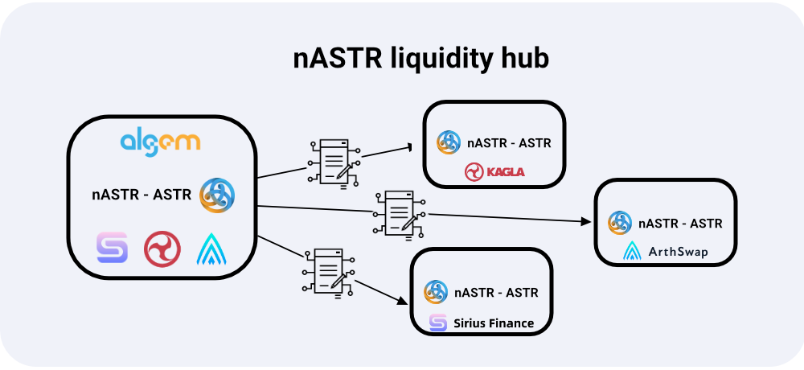

# 📔 nASTR Farming

nASTR Farming – ซึ่งก่อนหน้านี้เราเรียกว่า nASTR Liquidity Hub – เป็นกลุ่มของสัญญาที่ปรับปรุงประสบการณ์ผู้ใช้โดยอนุญาตให้ผู้ถือ nASTR โต้ตอบกับโปรโตคอลอื่นเพื่อใช้โทเค็น nASTR ของพวกเขาโดยตรงบน Algem.

<figure><figcaption></figcaption></figure>

สัญญา nASTR farming จะได้รับโทเค็น $nASTR จากนั้นพร็อกซีดำเนินการกับโปรโตคอลที่เลือก. เมื่อล็อคสัญญาแล้ว โทเค็นจะไม่สามารถเปลี่ยนแปลงได้เว้นแต่จะลบสภาพคล่องออก.

ผู้ใช้สามารถโอนโทเค็นเข้าสู่สัญญา nASTR farming ผ่านธุรกรรมเดียว ปรับปรุงประสบการณ์ของผู้ใช้ในเวลาเดียวกัน โดยหลีกเลี่ยงการเปลี่ยนไปใช้เว็บไซต์อื่นเพื่อใช้โปรโตคอล Defi ต่างๆ.

การใช้ nASTR Farming และบน Algem โดยตรง, ผู้ถือ nASTR สามารถ:

* สามารถให้สภาพคล่อง nASTR และโทเค็น LP เดิมพันบน AMM Standard และ Stablecoin Protocols.
* สามารถให้ยืมโทเค็น nASTR กับแพลตฟอร์มการให้ยืมและหลักประกันได้.
* ยืนยันและรับรางวัลการทําฟาร์ม Lp.

### ประโยชน์ของ nASTR Farming  คืออะไร

* การป้องกัน Flashloan ผ่านการใช้งานบัฟเฟอร์: มีหลายสถานการณ์ที่ไม่สามารถทำได้เมื่อส่งเสริมรางวัลการเดิมพันผ่านโทเค็น LP. ตัวอย่างเช่นผู้ใช้สามารถใช้ flashloan เพื่อรับรางวัลและรับมากขึ้นอย่างมีนัยสําคัญด้วยวิธีนี้โดยส่งคืนโทเค็น LP เมื่อสิ้นสุดการทําธุรกรรม. ความเสี่ยงจะเพิ่มขึ้นในอนาคตเมื่อ Defi dApps เสนอบริการ flashloan มากขึ้น.
* การป้องกันจากการจัดการ LP: บอทบางตัวสามารถตรวจสอบ mempool และสลับโทเค็นระหว่างบัญชีของพวกเขาเพื่อเพิ่มจำนวนรางวัล.
* มันปรับปรุงประสบการณ์การใช้งานของผู้ใช้เช่น:
  * ผู้ใช้ไม่จำเป็นต้องเยี่ยมชมเว็บไซต์หลายแห่งเพื่อเพิ่มโทเค็นไปยัง dApps เพิ่มเติมอีกต่อไป;&#x20;
  * ผู้ใช้ต้องการการดำเนินการน้อยลงสำหรับกระบวนการฝากและถอนโทเค็นทั้งหมด;
  * ผู้ใช้สามารถอ่านยอดคงเหลือทั้งหมดได้ในที่เดียว;&#x20;
  * ผู้ใช้สามารถเลือก DEX ที่ต้องการโต้ตอบและดูสถิติผ่าน Algem ได้โดยตรงในอนาคต.
* การคำนวณ : การคำนวณรางวัลที่แม่นยำยิ่งขึ้นและความปลอดภัยของแพลตฟอร์มที่สูงขึ้นสำหรับผู้ใช้.
* ความปลอดภัย: การป้องกันความเป็นไปได้ของการระบายเงินทุนจากหรือทำให้สัญญาผู้ให้บริการ LP ล้มละลาย.
* รองรับโปรโตคอลเพิ่มเติม: ไม่ใช่ทุก dApp ที่รองรับ $nASTR ด้วยเหตุผลทางเทคนิค. ในบรรดาเหล่านี้ ได้แก่ dApps เช่น AstridDAO และ Arthswap ซึ่งมีความสำคัญต่อระบบนิเวศของ Astar.

ข้อมูลเพิ่มเติมเกี่ยวกับวิธีใช้ nASTR Farming ของ Algem [ในส่วนคู่มือผู้ใช้](../undefined/how-to-use-algems-nastr-farming/).
