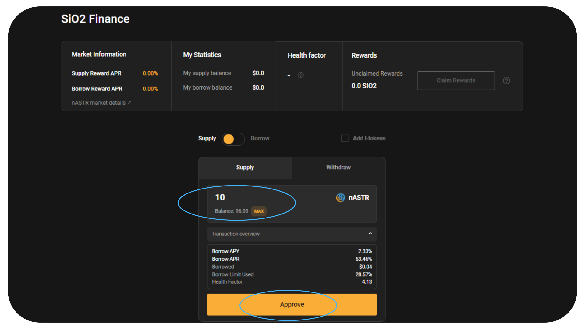
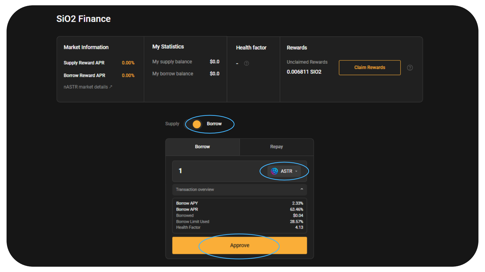

# 🍋 SiO2 Finance

[SiO2 Finance](https://www.sio2.finance/) เป็นศูนย์กลางการให้ยืมหลาย VM บน Astar สำหรับ Polkadot. พวกเขาตั้งเป้าที่จะเป็นผลิตภัณฑ์สินเชื่อที่ดีที่สุดพร้อมประสบการณ์ผู้ใช้ที่ยอดเยี่ยม, ฟีเจอร์คลิกเดียวที่ใช้งานง่าย และการกำกับดูแลที่โปร่งใส.

nASTR Farming ของ Algem รองรับ SiO2 Finance แล้ว. ผู้ถือ nASTR สามารถให้ยืมโทเค็นเพื่อเป็นหลักประกันในการยืมสินทรัพย์อื่นๆที่มีอยู่ในแพลตฟอร์มการให้ยืม เช่น ASTR, DOT, USDT, USDC, WBTC, WETH เป็นต้น.

## วิธีการฝากเงิน nASTR ของคุณและวิธีการกู้ยืมใน SiO2 Finance?

เมื่อคุณเดิมพันโทเค็น ASTR บน [algem.io](https://www.algem.io/) และได้รับโทเค็น nASTR, แล้ว ให้เลือก SiO2 Finance ใน nASTR Farming.

[⚠️ คำเตือน: ก่อนยืมสินทรัพย์อื่นบน SiO2 โปรดทำความเข้าใจแนวคิดของปัจจัยด้านสุขภาพ วงเงินการยืม และการชำระบัญชีโดยใช้รูปแบบการให้ยืม. ⚠️](https://docs.algem.io/get-started/how-to-use-algems-nastr-farming/sio2-finance#be-aware-of-risks)

จากการเปิดตัวอแด็ปเตอร์, เฉพาะโทเค็น ASTR เท่านั้นที่สามารถยืมได้ในช่วงสองสามสัปดาห์แรก เพื่อหลีกเลี่ยงความเสี่ยงของการชำระบัญชี ในขณะที่ผู้ใช้ Algem ทำความคุ้นเคยกับแนวคิดของแพลตฟอร์มการให้ยืม.

### รายละเอียดตลาด nASTR:

**สินเชื่อเพื่อมูลค่า (LTV) : 40%** - คุณสามารถยืมได้มากถึง 40% ของมูลค่าหลักประกัน nASTR ของคุณ;

**เกณฑ์การชำระบัญชี : 48% -** หากมูลค่ายืมเพิ่มขึ้นมากกว่า 48% ของหลักประกัน, แสดงว่าหลักประกันไม่เพียงพอ.

_โดยทั่วไปเกณฑ์การชำระบัญชีจะสูงกว่าอัตราส่วน LTV. ตัวอย่างเช่น, หากเกณฑ์การชำระบัญชีสำหรับสินทรัพย์คือ 48% และผู้กู้ได้ยืม LTV สูงสุดที่ 40%. หากมูลค่าของหลักประกันลดลงจนทำให้เงินกู้ของพวกเขาคิดเป็น 48% ขึ้นไปของมูลค่าหลักประกัน หลักประกันจะถูกชำระบัญชี._

_ตัวอย่าง: สมมติว่าผู้ใช้ฝาก 10,000 ASTR มูลค่า $1,000 เป็นหลักประกัน. ด้วยอัตราส่วน LTV ที่ 40% พวกเขาสามารถยืมสินทรัพย์อื่นมูลค่า $400 ได้. หากราคาของ ASTR ลดลงจนมูลค่าของหลักประกันตกลงไปที่ $833.33 เงินกู้ของพวกเขาจะคิดเป็น 48% ของมูลค่าหลักประกัน ($400/$833.33 = 48%). ณจุดนี้ แพลตฟอร์มจะเริ่มชำระหลักประกันของผู้กู้เพื่อชำระคืนเงินกู้._

**ค่าปรับการชำระบัญชี : 12.50%**

_ค่าปรับการชำระบัญชีเป็นค่าใช้จ่ายเพิ่มเติมที่ใช้เมื่อหลักประกันของผู้กู้ถูกชำระบัญชี. สิ่งนี้ทำหน้าที่เป็นตัวขัดขวางการกู้ยืมมากกว่าที่จะชำระคืนอย่างปลอดภัยและให้ความปลอดภัยเพิ่มเติมแก่ผู้ให้กู้._

_ค่าปรับการชำระบัญชีจะถูกเพิ่มเข้ากับจำนวนเงินที่ผู้กู้ค้างชำระณเวลาที่ชำระบัญชี. หลักประกันของผู้กู้จะถูกขายออกจนกว่าจะชำระคืนเงินกู้และค่าปรับการชำระบัญชี._

_ตัวอย่าง: ใช้ตัวอย่างเดียวกัน, สมมติว่ามีค่าปรับการชำระบัญชี 12.5%. หากเงินกู้ของผู้กู้จำนวน $400 ถูกชำระบัญชี เงินอีก $50 (12.5% ​​ของ $400) จะถูกเพิ่มเข้าไปในจำนวนเงินที่เป็นหนี้. หลักประกันของพวกเขาจะถูกขายออกจนกว่าจะชำระคืนเป็น $450 ._

### วิธีจัดหาสภาพคล่องของคุณ:

* เลือกตัวเลือกการสนับสนุน;
* ป้อนจำนวน nASTR ที่คุณต้องการจัดหา;
* ยืนยันการดำเนินการโดยคลิกที่ "Deposit" และลงนามธุรกรรมในกระเป๋าเงินของคุณ.

<figure><figcaption></figcaption></figure>

ตัวเลือก: หากคุณได้จัดเตรียมสภาพคล่องบน SIO2 และได้รับ I-tokens แล้ว และคุณยังสามารถฝากโทเค็น I-tokens ของคุณบน Algem Farming.

### วิธียืมสินทรัพย์โทเค็น:

* คลิกตัวเลือกยืม;
* เลือกโทเค็นที่คุณต้องการยืมจากรายการที่มีอยู่;
* ใส่จำนวนเงิน;
* ตรวจสอบวงเงินกู้และปัจจัยด้านสุขภาพของคุณ;
* ยืนยันการดำเนินการโดยคลิกที่ "borrow" และลงนามธุรกรรมในกระเป๋าเงินของคุณ.

<figure><figcaption></figcaption></figure>

### วิธีชำระหนี้ของคุณ:

* เลือกตัวเลือกยืมและเปลี่ยนเป็นชำระคืน;
* เลือกโทเค็นที่คุณต้องการชำระคืนจากรายการที่ยืมมา;
* ป้อนจำนวนเงินที่คุณต้องการชำระคืน;

_จำนวนเงินที่ต้องชำระคืนสูงกว่าจำนวนเงินที่ยืม (เนื่องจากรวมดอกเบี้ยเงินกู้แล้ว)._

* ตรวจสอบวงเงินกู้และปัจจัยสุขภาพใหม่ของคุณ;
* ยืนยันการดำเนินการโดยคลิกที่ "Repay" และลงนามธุรกรรมในกระเป๋าเงินของคุณ.

<figure><figcaption></figcaption></figure>

### วิธีถอนสภาพคล่องของคุณ:

* อย่าลืมรับรางวัลฟาร์มทั้งหมดของคุณก่อนที่จะถอนสภาพคล่องของคุณ;
* เลือกตัวเลือกการจัดหาและเปลี่ยนเป็นการถอน;
* ป้อนจำนวน nASTR ที่คุณต้องการถอน;
* ตรวจสอบดูว่าวงเงินการยืมและปัจจัยด้านสุขภาพของคุณอนุญาตให้คุณถอนโทเค็นที่คุณฝากไว้หรือไม่;

_ถ้าไม่ คุณต้องชำระหนี้บางส่วนหรือทั้งหมดก่อนจึงจะสามารถถอนสภาพคล่องได้._

* ยืนยันการดำเนินการโดยคลิกที่ "Withdraw" และลงนามธุรกรรมในกระเป๋าเงินของคุณ.

<figure><figcaption></figcaption></figure>

### วิธีเพิ่มปัจจัยด้านสุขภาพของคุณ:

หากปัจจัยด้านสุขภาพของคุณใกล้ 1 คุณเสี่ยงต่อการถูกชำระบัญชี, ดังนั้นจึงต้องเพิ่มขึ้น.

เพื่อเพิ่มปัจจัยด้านสุขภาพของคุณ,

* คุณสามารถชำระคืนเงินกู้ของคุณได้.
* จัดหาหลักประกันเพิ่มเติม (nASTR);

### รับรางวัลของคุณจาก nASTR Farming

* เลือก SiO2 Finance dApp ในส่วนการทำฟาร์ม;
* คลิกที่ปุ่ม "Claim rewards" และลงนามธุรกรรมในกระเป๋าเงินของคุณ;
* รางวัลของคุณจะถูกแจกจ่ายโดยตรงไปยังกระเป๋าเงินของคุณ

<figure><figcaption></figcaption></figure>

## กลยุทธ์ Defi โดยใช้ Algem และ Si02 Finance :

นี่คือตัวอย่างของกลยุทธ์ Defi ที่ใช้ SiO2 บน Algem เพื่อเพิ่ม liquid dApp staking ให้สูงสุดและรับรางวัลการเดิมพันมากขึ้นด้วยโทเค็น ASTR ตามจำนวนที่กำหนด :

* เดิมพัน 1,000 ASTR บน Algem, รับ 1,000 nASTR;
* ให้ยืม 1,000 nASTR บน Si02 บน Algem Farming;
* ยืมมากถึง 400 ASTR;
* เดิมพัน 400 ASTR อีกครั้งบน Algem และรับ 400 nASTR;
* รวบรวมรางวัลการเดิมพันของคุณ;

จาก 1,000 ASTR ตอนนี้คุณได้รับรางวัลเดิมพัน 1,500 nASTR (ฝาก 1,000 ASTR + ยืม 500 ASTR).

<figure><figcaption></figcaption></figure>

## รู้ทันความเสี่ยง!

ก่อนใช้โปรโตคอลการให้ยืม เช่น SiO2 Finance ตรวจสอบให้แน่ใจว่าคุณตระหนักถึงความเสี่ยง:

* Liquidation: เช่นเดียวกับการให้กู้ยืมทุกประเภท การให้ยืมของ Defi มีความเสี่ยงที่ผู้กู้จะผิดนัดชำระหนี้. เมื่อผู้ใช้ยืมบนแพลตฟอร์มการให้ยืม, "health factor" จะเชื่อมโยงกับตำแหน่งของผู้ใช้. ปัจจัยด้านสุขภาพ (HF) เป็นตัวบ่งชี้ความปลอดภัยของตำแหน่งที่ฝากไว้เมื่อเทียบกับตำแหน่งที่ยืมมา. ยิ่ง HF สูงเท่าใด สินทรัพย์ที่ฝากไว้ก็จะปลอดภัยจากการชำระบัญชีมากขึ้นเท่านั้น. \
  \
  หาก HF ต่ำกว่า 1 สินทรัพย์ที่ฝากไว้อาจถูกชำระบัญชี. การชำระบัญชีเป็นกระบวนการที่มีการชำระคืนหนี้ของผู้กู้สูงสุด X % และค่านี้ + ค่าธรรมเนียมการชำระบัญชีจะนำมาจากหลักประกันที่มีอยู่ของผู้ใช้. หลังจากการชำระบัญชี จำนวนหนี้ที่ชำระบัญชีจะได้รับการชำระคืน. เพื่อหลีกเลี่ยงการชำระบัญชี ตรวจสอบให้แน่ใจว่า HF ของคุณมากกว่า 1. ผู้ใช้สามารถเพิ่ม HF ของเขาได้โดยการฝากสินทรัพย์ค้ำประกันมากขึ้นหรือชำระคืนเงินกู้บางส่วน. \
  \
  เรียนรู้เพิ่มเติมใน [SiO2 Finance's documentation.](https://sio2-finance.gitbook.io/en/systems/risk-parameters)
* **Smart-contract เสี่ยง.** SiO2 Finance ได้รับการพัฒนาโดยใช้ [Aave V2](https://docs.aave.com/developers/v/2.0/security-and-audits) ซึ่งผ่านการตรวจสอบอย่างเข้มงวดแล้ว. SiO2 ยังได้รับการตรวจสอบโดย [PeckShield ](https://github.com/SiO2-Finance/contracts/tree/main/audits)แต่โปรดทราบว่าการตรวจสอบความปลอดภัยไม่ได้ขจัดความเสี่ยงทั้งหมด. อย่าฝากทรัพย์สินที่คุณไม่สามารถจะสูญเสียให้กับ SiO2 Finance ในฐานะผู้ให้กู้.

## Smart-contracts:

<table><thead><tr><th width="264">ชนิด</th><th>Contract address</th></tr></thead><tbody><tr><td>Sio2Adapter</td><td><a href="https://blockscout.com/astar/address/0xAB06472A169e9eA3147A722464631D10553E384D">0xAB06472A169e9eA3147A722464631D10553E384D</a></td></tr><tr><td>Sio2AdapterAssetManager</td><td><a href="https://blockscout.com/astar/address/0x57c9f22168f315D33E1270b617F32F7940B89D67">0x57c9f22168f315D33E1270b617F32F7940B89D67</a></td></tr><tr><td>Sio2AdapterData</td><td><a href="https://blockscout.com/astar/address/0x01Daa46901103aED46F86d8be5376c3e12E8bd8b">0x01Daa46901103aED46F86d8be5376c3e12E8bd8b</a></td></tr></tbody></table>
