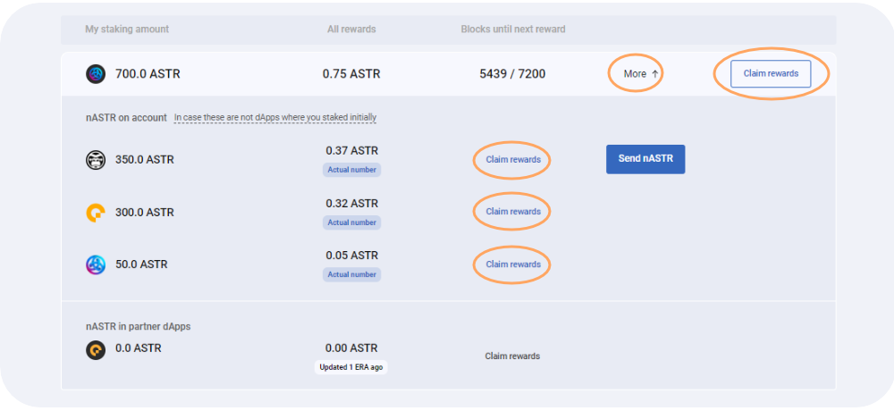

# 🖥 รุ่นเดสก์ท็อป



## ภาพรวม

**Total ASTR Staked** -> จำนวนโทเคน ASTR ทั้งหมดที่วางเดิมพันบน Algem protocol.\
**APR** -> อัตราเปอร์เซ็นต์ต่อปีคำนวณจากกฎ APR และ Algem ของ dApp staking ปัจจุบัน.\
**Unstaking pool** -> โทเค็น ASTR พร้อมใช้งานสำหรับ unstaking ทันที.\
**My Staking amount** -> จำนวน nASTR ในกระเป๋าเงินของผู้ใช้, รวมถึงโทเค็นพื้นฐาน, โทเค็น Lp, หรือโทเค็นหลักประกัน.\
**All Rewards** -> รางวัล staking เพื่อเรียกร้อง.\
**Blocks until next reward** -> บล็อกที่เหลือจนกว่าจะถึง era ถัดไป, และจนกว่าจะมีการแจกรางวัลในภายหลังใน pool ของรางวัลของผู้ใช้.

## แนะนำ:

เมื่อคุณมีโทเค็น ASTR ในกระเป๋าเงิน EVM แล้ว, คุณสามารถไปที่ส่วน liquid staking ใน Algem dApp และเชื่อมต่อกระเป๋าเงิน EVM ของคุณได้.

### วิธีการ Stake:

* ป้อนจำนวนโทเค็น ASTR ที่คุณต้องการฝาก (ขั้นต่ำ 100 ASTR).
* จากนั้นเลือก dApp;
* ยืนยันการกระทำของคุณโดยคลิกที่ปุ่ม stake.
* รับโทเค็น nASTR ในจำนวนที่เท่ากันและเริ่มรับรางวัล staking.
* ใช้โทเค็น nASTR เพื่อทำฟาร์มบน Defi dApps ของพันธมิตรของเราใน [nASTR Farming ของเรา](../how-to-use-algems-nastr-farming/).

เมื่อ Algem มอบหมายโทเค็น ASTR ของคุณให้กับ Astar dApp Staking แล้ว, คุณจะได้รับจำนวนเงินเท่ากับจำนวนที่ฝากในโทเค็น nASTR และเริ่มรับรางวัล staking.

คุณสามารถเพิ่มโทเคน nASTR ใน Metamask ได้โดยเพิ่มที่อยู่โทเคนต่อไปนี้, หรือใช้คุณลักษณะเฉพาะใน Algem dApp.

_**nASTR:**_ 0xE511ED88575C57767BAfb72BfD10775413E3F2b0

### วิธีการเรียกร้อง:

* ในการรับรางวัลของคุณ, คุณต้องรออย่างน้อย 1 era (ประมาณ 24 ชั่วโมงบนเครือข่าย Astar);
* จากนั้นกดปุ่ม “claim” และยืนยันการทำธุรกรรม;
* รางวัลของคุณจะถูกแจกจ่ายโดยตรงไปยังกระเป๋าเงินของคุณ.

### วิธีการ Unstake:

* อย่าลืมเรียกร้อง Stake รางวัลทั้งหมดของคุณก่อน Un-stake โทเค็นของคุณ.
* ในการถอนโทเค็น nASTR ของคุณและแลกโทเค็น ASTR, คุณต้องเปลี่ยนเป็นโหมด "unstake" ก่อน;
* ป้อนจำนวน nASTR ที่คุณต้องการถอนออกจาก dApp ที่เลือก;
* คุณสามารถถอนผลประโยชน์จาก dApps หนึ่ง, หลายรายการ, หรือทั้งหมดพร้อมกันได้.
* เลือกพารามิเตอร์ [unstaking ](../../algem-protocol/liquid-dapp-staking/unstaking-nastr.md)(ปกติหรือทันที) และยอมรับเงื่อนไข;
* ยืนยันการกระทำของคุณโดยคลิกปุ่ม "unstake".

คุณจะได้รับโทเค็น ASTR ของคุณโดยตรงในกระเป๋าเงินของคุณหลังจากปฏิบัติตามเงื่อนไข unstaking (เช่น, ระยะเวลาที่ไม่ผูกมัด).

