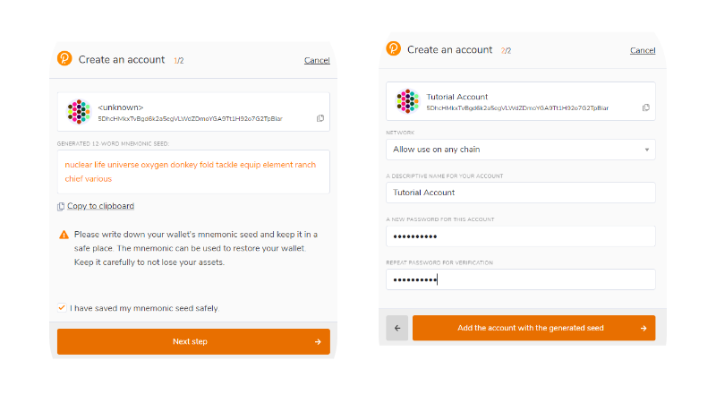

# \* \* Polkadot{.js}

### Install Polkadot.js Plugin

To create a Polkadot.js, install the Browser Plugin available for both [Google Chrome](https://chrome.google.com/webstore/detail/polkadot%7Bjs%7D-extension/mopnmbcafieddcagagdcbnhejhlodfdd?hl=en) (and Chromium-based browsers like Brave) and [Firefox](https://addons.mozilla.org/en-US/firefox/addon/polkadot-js-extension/). \
\
After installing the plugin, you should see the orange and white Polkadot{.js} logo in your browser menu bar.

### Create Polkadot.js Wallet

Open the Polkadot{.js} extension and click on the + button - "Create a new account".

Polkadot{.js} will randomly generate a new seed for you and display it as twelve words. **Save these words in a safe place.**

Choose a descriptive name for your wallet and a password. You must enter your password a second time to confirm it.

Congratulations, you have just created your first polkadot (native) substrate wallet!
