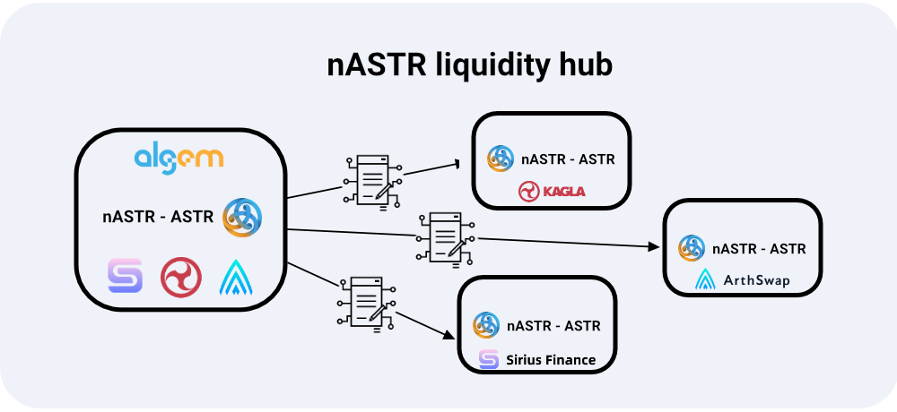

# 📔 nASTR Farming

The nASTR Farming – which we previously referred to as nASTR Liquidity Hub – is a group of **intermediate contracts** that improve the user experience by allowing nASTR holders to interact with other protocols to use their nASTR tokens directly on Algem.

<figure><figcaption></figcaption></figure>

The nASTR liquidity farming is receiving $nASTR tokens and then proxy the actions to the selected protocol. Once locked in the contract, the balance cannot be changed unless removing the liquidity.

Users can transfer tokens into the nASTR farming contract through a single transaction improving at the same time the user experience by avoiding to switch to different website to use various Defi protocols.

Using nASTR Farming and directly on Algem, nASTR holders can:&#x20;

* สามารถให้สภาพคล่อง nASTR และโทเค็น LP เดิมพันบน AMM Standard และ Stablecoin Protocols.
* สามารถให้ยืมโทเค็น nASTR กับแพลตฟอร์มการให้ยืมและหลักประกันได้.
* ยืนยันและรับรางวัลการทําฟาร์ม Lp.

### ประโยชน์ของ nASTR Liquidity Hub คืออะไร

* การป้องกัน Flashloan ผ่านการใช้งานบัฟเฟอร์: มีหลายสถานการณ์ที่ไม่สามารถทำได้เมื่อส่งเสริมรางวัลการเดิมพันผ่านโทเค็น LP. ตัวอย่างเช่นผู้ใช้สามารถใช้ flashloan เพื่อรับรางวัลและรับมากขึ้นอย่างมีนัยสําคัญด้วยวิธีนี้โดยส่งคืนโทเค็น LP เมื่อสิ้นสุดการทําธุรกรรม. ความเสี่ยงจะเพิ่มขึ้นในอนาคตเมื่อ Defi dApps เสนอบริการ flashloan มากขึ้น.
* การป้องกันจากการจัดการ LP: บอทบางตัวสามารถตรวจสอบ mempool และสลับโทเค็นระหว่างบัญชีของพวกเขาเพื่อเพิ่มจำนวนรางวัล.
* มันปรับปรุงประสบการณ์การใช้งานของผู้ใช้เช่น:
  * ผู้ใช้ไม่จำเป็นต้องเยี่ยมชมเว็บไซต์หลายแห่งเพื่อเพิ่มโทเค็นไปยัง dApps เพิ่มเติมอีกต่อไป;&#x20;
  * ผู้ใช้ต้องการการดำเนินการน้อยลงสำหรับกระบวนการฝากและถอนโทเค็นทั้งหมด;
  * ผู้ใช้สามารถอ่านยอดคงเหลือทั้งหมดได้ในที่เดียว;&#x20;
  * ผู้ใช้สามารถเลือก DEX ที่ต้องการโต้ตอบและดูสถิติผ่าน Algem ได้โดยตรงในอนาคต.
* การคำนวณ : การคำนวณรางวัลที่แม่นยำยิ่งขึ้นและความปลอดภัยของแพลตฟอร์มที่สูงขึ้นสำหรับผู้ใช้.
* ความปลอดภัย: การป้องกันความเป็นไปได้ของการระบายเงินทุนจากหรือทำให้สัญญาผู้ให้บริการ LP ล้มละลาย.
* รองรับโปรโตคอลเพิ่มเติม: ไม่ใช่ทุก dApp ที่รองรับ $nASTR ด้วยเหตุผลทางเทคนิค. ในบรรดาเหล่านี้ ได้แก่ dApps เช่น AstridDAO และ Arthswap ซึ่งมีความสำคัญต่อระบบนิเวศของ Astar.

More information on how to use Algem's nASTR Farming in the user [guide section.](../get-started/how-to-use-algems-nastr-farming/)
