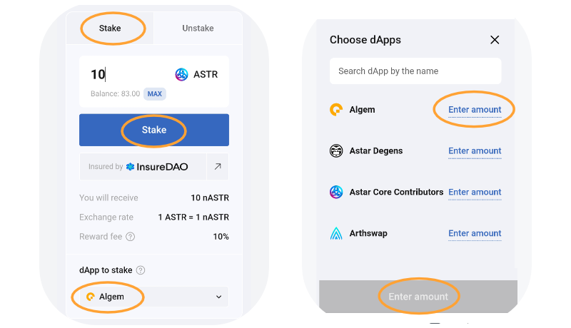

# 📱 รุ่นมือถือ

หากต้องการเข้าถึง Algem บนโทรศัพท์ของคุณ, เราขอแนะนำให้ใช้แอปมือถือ Metamask ที่มีอยู่ใน OS หรือ Android. ระวัง Metamask ปลอมและใช้เว็บไซต์ทางการเท่านั้น! [>https://metamask.io/](https://metamask.io/)

### แนะนำ:

เมื่อกระเป๋าเงินของคุณเชื่อมต่อกับ Metamask mobile และคุณมีโทเค็น ASTR, คุณสามารถไปที่เบราว์เซอร์และค้นหา [Algem.io](http://algem.io/);

<figure><figcaption></figcaption></figure>

### วิธีการ Stake:

* ป้อนจำนวนโทเค็น ASTR ที่คุณต้องการฝาก (ขั้นต่ำ 100 ASTR).
* จากนั้นเลือก dApp;
* ยืนยันการกระทำของคุณโดยคลิกที่ปุ่ม stake.
* รับโทเค็น nASTR ในจำนวนที่เท่ากันและเริ่มรับรางวัล staking.
* Use nASTR tokens to farm on our partners Defi dApps in our [nASTR Farming](https://docs.algem.io/get-started/how-to-use-algems-nastr-liquidity-hub);

เมื่อ Algem มอบหมายโทเค็น ASTR ของคุณให้กับ Astar dApp Staking แล้ว, คุณจะได้รับจำนวนเงินเท่ากับจำนวนที่ฝากในโทเค็น nASTR และเริ่มรับรางวัล staking.

คุณสามารถเพิ่มโทเคน nASTR ใน Metamask ได้โดยเพิ่มที่อยู่โทเคนต่อไปนี้, หรือใช้คุณลักษณะเฉพาะใน Algem dApp.

_**nASTR:**_ 0xE511ED88575C57767BAfb72BfD10775413E3F2b0

<figure><figcaption></figcaption></figure>

### วิธีการเรียกร้อง:

* ในการรับรางวัลของคุณ, คุณต้องรออย่างน้อย 1 era (ประมาณ 24 ชั่วโมงบนเครือข่าย Astar);
* จากนั้นกดปุ่ม “claim” และยืนยันการทำธุรกรรม;
* รางวัลของคุณจะถูกแจกจ่ายโดยตรงไปยังกระเป๋าเงินของคุณ.

.png>)

### วิธีการ Unstake:

* ในการถอนโทเค็น nASTR ของคุณและแลกโทเค็น ASTR, คุณต้องเปลี่ยนเป็นโหมด "unstake" ก่อน;
* ป้อนจำนวน nASTR ที่คุณต้องการถอนออกจาก dApp ที่เลือก;
* คุณสามารถถอนผลประโยชน์จาก dApps หนึ่ง, หลายรายการ, หรือทั้งหมดพร้อมกันได้.
* เลือกพารามิเตอร์ [unstaking ](../../algem-protocol/liquid-dapp-staking/unstaking-nastr.md)(ปกติหรือทันที) และยอมรับเงื่อนไข;
* ยืนยันการกระทำของคุณโดยคลิกปุ่ม "unstake".

คุณจะได้รับโทเค็น ASTR ของคุณโดยตรงในกระเป๋าเงินของคุณหลังจากปฏิบัติตามเงื่อนไข unstaking (เช่น, ระยะเวลาที่ไม่ผูกมัด).

<figure><figcaption></figcaption></figure>
