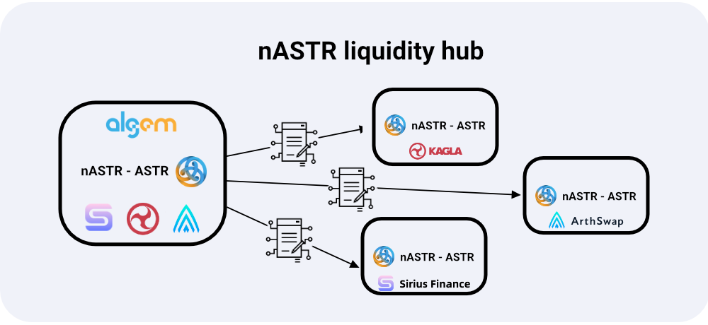

# 📔 nASTR Farming

nASTR Farming – mà trước đây chúng tôi gọi là nASTR Liquidity Hub – là một nhóm các hợp đồng trung gian giúp cải thiện trải nghiệm người dùng bằng cách cho phép chủ sở hữu nASTR tương tác với các giao thức khác để sử dụng mã thông báo nASTR của họ trực tiếp trên Algem.

<figure><figcaption></figcaption></figure>

Hợp đồng canh tác nASTR nhận token $nASTR và sau đó ủy quyền các hành động cho giao thức đã chọn. Sau khi bị khóa trong hợp đồng, số dư không thể thay đổi trừ khi loại bỏ tính thanh khoản.

Người dùng có thể chuyển token vào nASTR farming contract thông qua một giao dịch duy nhất đồng thời cải thiện trải nghiệm người dùng bằng cách tránh chuyển sang trang web khác để sử dụng các giao thức Defi khác nhau.

Sử dụng nASTR farming và trực tiếp trên Algem, những người nắm giữ nASTR có thể:

* Cung cấp thanh khoản nASTR và stake token LP trên Giao thức ổn định và tiêu chuẩn AMM.&#x20;
* Cho vay token nASTR cho các nền tảng cho vay và tài sản thế chấp.
* Yêu cầu và nhận phần thưởng farming

### Lợi ích của nASTR Farming là gì

* Bảo vệ flashloan thông qua triển khai đệm: Một số tình huống không thể xảy ra tồn tại khi phần thưởng đặt cược có thể được tăng cường hồi tố thông qua token LP. Ví dụ: người dùng có thể sử dụng khoản vay nhanh để nhận phần thưởng và nhận được nhiều hơn đáng kể theo cách đó, trả lại token LP khi kết thúc giao dịch. Rủi ro này sẽ tăng lên trong tương lai khi nhiều ứng dụng Defi đề xuất dịch vụ flashloan.
* Bảo vệ khỏi thao túng LP: Một số bot có thể giám sát mempool và chuyển đổi token giữa các tài khoản của chúng nhằm tăng số tiền thưởng một cách giả tạo.
* Cải thiện trải nghiệm người dùng như:
  * Người dùng không còn cần phải truy cập nhiều trang web để thêm token của họ vào dApps bổ sung;
  * Người dùng yêu cầu ít hành động hơn cho toàn bộ quá trình gửi và rút token;&#x20;
  * Người dùng có thể đọc tất cả số dư ở một nơi;
  * Trong tương lai, người dùng có thể chọn DEX mà họ muốn tương tác và xem trực tiếp số liệu thống kê thông qua Algem.
* Sự tính toán: Tính toán phần thưởng chính xác hơn và bảo mật nền tảng cao hơn cho người dùng.
* Bảo mật: Bảo vệ khỏi khả năng rút tiền từ hoặc phá sản hợp đồng với nhà cung cấp LP.
* Hỗ trợ nhiều giao thức hơn: Không phải tất cả dApp đều có thể hỗ trợ $nASTR vì lý do kỹ thuật. Trong số này có các dApp như AstridDAO và Arthswap, rất quan trọng đối với hệ sinh thái Astar.

Thông tin thêm về cách sử dụng Algem's nASTR Farming trong [phần hướng dẫn sử dụng](../bat-dau-nao/cach-su-dung-nastr-farming-cua-algem/).
