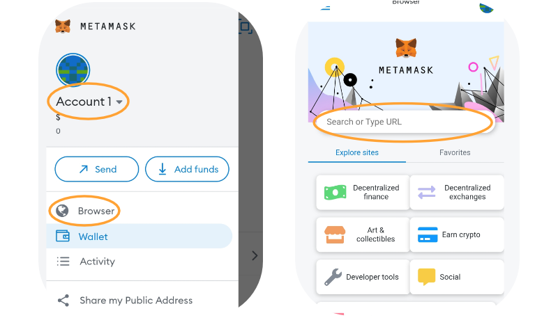
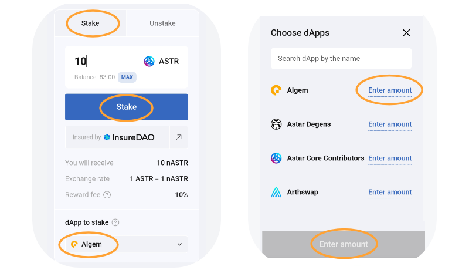

# 📱 Phiên bản Mobile

Để truy cập Algem trên điện thoại của bạn, chúng tôi khuyên bạn nên sử dụng ứng dụng di động Metamask có sẵn trên OS hoặc Android. Cảnh giác với Metamask giả mạo và chỉ sử dụng trang web chính thức! ->[https://metamask.io/](https://metamask.io/)

### Hướng dẫn:

Khi ví của bạn được kết nối với Metamask di động và bạn có token ASTR, bạn có thể truy cập trình duyệt và tìm kiếm [Algem.io](http://algem.io/);

<figure><figcaption></figcaption></figure>

### Làm sao để stake:&#x20;

* Nhập số lượng token ASTR bạn muốn gửi, (tối thiểu 100 ASTR)
* Sau đó chọn dApp;
* Xác nhận hành động của bạn bằng cách nhấp vào nút stake.
* Nhận số lượng token nASTR tương đương và bắt đầu kiếm phần thưởng staking.
* Sử dụng token nASTR để farming trên các ứng dụng Defi của đối tác trong [Trang trai nASTR](https://docs.algem.io/get-started/how-to-use-algems-nastr-liquidity-hub) của chúng tôi;

Khi Algem đã ủy quyền token ASTR của bạn cho Astar dApp Staking, bạn sẽ nhận được số tiền tương đương với số tiền được gửi vào token nASTR và bắt đầu kiếm phần thưởng staking.

Bạn có thể thêm token nASTR vào Metamask bằng cách thêm địa chỉ token sau hoặc sử dụng tính năng chuyên dụng trong Algem dApp.

_**nASTR:**_ 0xE511ED88575C57767BAfb72BfD10775413E3F2b0

<figure><figcaption></figcaption></figure>

### Làm sao để claim:

* Để nhận phần thưởng của mình, trước tiên bạn phải đợi ít nhất 1 era (\~24 giờ trên mạng Astar);
* Sau đó nhấn nút “claim” và xác nhận giao dịch;
* Phần thưởng của bạn sẽ được phân phối trực tiếp vào ví của bạn.

.png>)

### Làm sao để unstake:

* Hãy chắc chắn yêu cầu tất cả phần thưởng đặt cược của bạn trước khi hủy đặt cược mã thông báo của bạn.
* Để unstake token nASTR của bạn và đổi lấy token ASTR, trước tiên bạn phải chuyển sang chế độ “unstake”;
* Nhập số lượng nASTR bạn muốn unstake từ dApp đã chọn;
* Bạn có thể unstake từ một, một số hoặc tất cả dApps cùng một lúc.
* Chọn các[ tham số unstaking](../../algem-protocol/liquid-dapp-staking/unstaking-nastr.md) (thông thường hoặc ngay lập tức) và chấp nhận các điều kiện;
* Xác nhận hành động của bạn bằng cách nhấp vào nút “unstake”.

Bạn sẽ nhận được token ASTR trực tiếp vào ví của mình sau khi đáp ứng các điều kiện unstaking (ví dụ: thời gian hủy liên kết).

<figure><figcaption></figcaption></figure>
