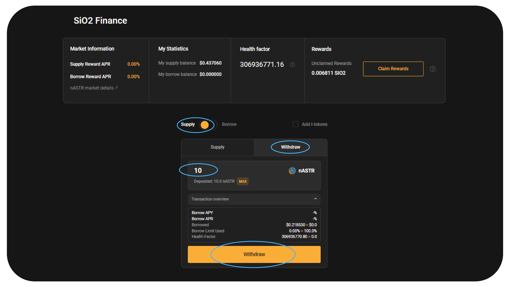
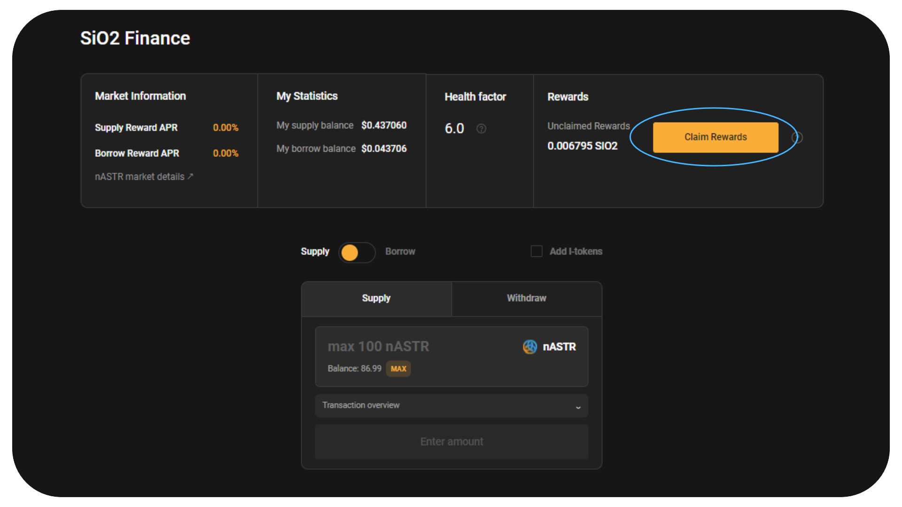

# 🍋 SiO2 Finance

[SiO2 Finance](https://www.sio2.finance/) là trung tâm cho vay đa VM trên Astar cho Polkadot. Họ đặt mục tiêu trở thành sản phẩm cho vay tốt nhất với trải nghiệm người dùng tuyệt vời, các tính năng một cú nhấp chuột dễ sử dụng và quản trị minh bạch.

Algem's nASTR Farming hiện đang hỗ trợ SiO2 Finance. Chủ sở hữu nASTR có thể cho mượn mã thông báo của họ làm tài sản thế chấp để vay các tài sản khác có sẵn trên nền tảng cho vay như ASTR, DOT, USDT, USDC, WBTC, WETH, v.v.

## Cách cung cấp nASTR của bạn và borrow trên SiO2 Finance

Khi bạn đã đặt cược mã thông báo ASTR trên [algem.io](https://www.algem.io/) và nhận được mã thông báo nASTR, hãy chọn Tài chính SiO2 trong trang trại nASTR.

⚠️ Cảnh báo: Trước khi vay các tài sản khác trên SiO2, hãy nhớ hiểu khái niệm về [Yếu tố sức khỏe, Giới hạn vay và thanh lý bằng cách sử dụng biểu mẫu cho vay](https://docs.algem.io/get-started/how-to-use-algems-nastr-farming/sio2-finance#be-aware-of-risks). ⚠️

Kể từ khi ra mắt bộ điều hợp, chỉ có thể mượn mã thông báo ASTR trong vài tuần đầu tiên, để tránh rủi ro thanh lý trong khi người dùng Algem làm quen với khái niệm về nền tảng cho vay.

### **nASTR Market Details:**

**Loan to Value:** 40% - Bạn có thể vay tới 40% Giá trị tài sản thế chấp nASTR của mình;

**Liquidation Threshold:** 48% - Nếu giá trị khoản vay tăng trên 48% tài sản thế chấp thì vị thế bị thiếu tài sản thế chấp.

_Ngưỡng thanh lý thường cao hơn tỷ lệ LTV. Ví dụ: nếu ngưỡng thanh lý đối với một tài sản là 48% và người đi vay đã vay đến LTV tối đa là 40%, nếu giá trị tài sản thế chấp của họ giảm đến mức khoản vay của họ hiện chiếm từ 48% trở lên giá trị tài sản thế chấp của họ , tài sản thế chấp của họ sẽ được thanh lý._

_Ví dụ: Giả sử người dùng gửi 10000 ASTR trị giá 1000 đô la làm tài sản thế chấp. Với tỷ lệ LTV là 40%, họ có thể vay một tài sản khác trị giá tới 400 đô la. Nếu giá của ASTR giảm đến mức giá trị tài sản thế chấp của họ giảm xuống còn 833,33 đô la, thì khoản vay của họ hiện chiếm 48% giá trị tài sản thế chấp của họ ($400/833,33 đô la = 48%). Tại thời điểm này, nền tảng sẽ bắt đầu thanh lý tài sản thế chấp của người vay để trả khoản vay._

**Liquidation Penalty : 12.50%**

_Hình phạt thanh lý là một khoản phí bổ sung được áp dụng khi tài sản thế chấp của người vay được thanh lý. Điều này đóng vai trò ngăn cản việc vay mượn nhiều hơn mức có thể được hoàn trả một cách an toàn và cung cấp thêm sự an toàn cho người cho vay._

_Tiền phạt thanh lý được cộng vào số tiền người vay nợ tại thời điểm thanh lý. Tài sản thế chấp của người vay được bán cho đến khi khoản vay cộng với tiền phạt thanh lý được hoàn trả._

_Ví dụ: Sử dụng cùng một ví dụ, giả sử có một hình phạt thanh lý 12,5%. Nếu khoản vay 400 đô la của người đi vay đang được thanh lý, khoản bổ sung 50 đô la (12,5% của 400 đô la) sẽ được cộng vào số tiền họ nợ. Tài sản thế chấp của họ sẽ được bán cho đến khi $450 được hoàn trả._

### Cách cung cấp thanh khoản của bạn:

* Chọn tùy chọn Cung cấp;
* Nhập số lượng nASTR bạn muốn cung cấp;
* Xác nhận hành động bằng cách nhấp vào “Gửi tiền” và ký tên vào giao dịch trong ví của bạn.

<figure><figcaption></figcaption></figure>

Tùy chọn: Nếu bạn đã cung cấp tính thanh khoản trên SIO2 và đã nhận được I-token, bạn vẫn có thể gửi các I-token của mình trên Algem Farming.

### Cách thức Borrow tài sản:

* Nhấp vào tùy chọn Mượn;
* Chọn mã thông báo bạn muốn mượn từ danh sách có sẵn;
* Nhập số tiền;
* Kiểm tra giới hạn vay và yếu tố sức khỏe của bạn;
* Xác nhận hành động bằng cách nhấp vào “Mượn” và ký tên vào giao dịch trong ví của bạn.

<figure><figcaption></figcaption></figure>

### Làm thế nào để Repay khoản nợ của bạn:

* Chọn tùy chọn Vay và chuyển sang Trả nợ;
* Chọn mã thông báo bạn muốn hoàn trả từ danh sách đã mượn;
* Nhập số tiền bạn cần hoàn trả;

_Số tiền phải trả cao hơn số tiền đã vay, vì nó bao gồm cả tiền lãi cho khoản vay._

* Kiểm tra giới hạn vay của bạn và yếu tố sức khỏe mới;
* Xác nhận hành động bằng cách nhấp vào “Trả nợ” và ký tên vào giao dịch trong ví của bạn.

<figure><figcaption></figcaption></figure>

### Cách Withdraw thanh khoản của bạn:

* Đảm bảo yêu cầu tất cả phần thưởng canh tác của bạn trước khi rút thanh khoản;
* Chọn tùy chọn Cung cấp và chuyển sang Rút tiền;
* Nhập số lượng nASTR bạn muốn rút;
* Kiểm tra xem giới hạn vay và yếu tố sức khỏe của bạn có cho phép bạn rút mã thông báo đã ký gửi hay không;

_Nếu không, trước tiên bạn phải thanh toán một số hoặc tất cả các khoản nợ của mình trước khi có thể rút thanh khoản của mình._

* Xác nhận hành động bằng cách nhấp vào “Rút tiền” và ký tên vào giao dịch trong ví của bạn.

<figure><figcaption></figcaption></figure>

### Làm thế nào để tăng Health Factor của bạn:

Nếu hệ số sức khỏe của bạn gần bằng 1, bạn có nguy cơ bị thanh lý, vì vậy sẽ là khôn ngoan nếu bạn tăng nó lên.

Để tăng hệ số sức khỏe của bạn, bạn có thể

* Hoàn trả vị thế vay của bạn;
* Cung cấp thêm tài sản thế chấp (nASTR);

### Claim phần thưởng của bạn từ nASTR Farming

* Chọn dApp SiO2 Fiance trong phần canh tác;
* Nhấp vào nút “Yêu cầu phần thưởng” và ký giao dịch trong ví của bạn;
* Phần thưởng của bạn sẽ được phân phối trực tiếp vào ví của bạn

<figure><figcaption></figcaption></figure>

## Chiến lược Defi sử dụng Algem và Si02 Finance :

Đây là một ví dụ về chiến lược Defi sử dụng SiO2 trên Algem để tối đa hóa việc đặt cược dApp lỏng và kiếm được nhiều phần thưởng đặt cược hơn với số lượng mã thông báo ASTR đã đặt:

* Đặt cược 1000 ASTR trên Algem, nhận 1000 nASTR;
* Cho vay 1000 nASTR trên Si02 trong Algem's Farming;
* Vay tới 400 ASTR;
* Đặt cược lại 400 ASTR trên Algem và nhận 400 nASTR;
* Thu thập phần thưởng đặt cược của bạn;

Từ 1000 ASTR, bạn hiện nhận được phần thưởng đặt cược là 1400 nASTR (1000 ASTR ký gửi + 400 ASTR mượn).

<figure><figcaption></figcaption></figure>

## Hãy nhận biết những rủi ro!

Trước khi sử dụng giao thức Cho vay như SiO2 Finance, hãy chắc chắn rằng bạn nhận thức được các rủi ro:

*   **Liquidation:** Giống như tất cả các loại cho vay, cho vay Defi có rủi ro vỡ nợ của người vay. Khi người dùng vay trên nền tảng cho vay, "yếu tố sức khỏe" được liên kết với vị trí của họ. Yếu tố sức khỏe (HF) là một chỉ báo về mức độ an toàn của vị thế đã ký gửi so với vị thế đã mượn. HF càng cao, tài sản ký gửi càng an toàn khỏi bị thanh lý.

    Nếu HF giảm xuống dưới 1, tài sản ký gửi có thể được thanh lý. Thanh lý là một quá trình trong đó tối đa X % khoản nợ của người vay được hoàn trả và giá trị này + phí thanh lý được lấy từ tài sản thế chấp có sẵn của người dùng. Sau khi thanh lý, số nợ đã thanh lý được hoàn trả. Để tránh thanh lý, hãy đảm bảo HF của bạn lớn hơn 1. Người dùng có thể tăng HF của mình bằng cách gửi thêm tài sản thế chấp hoặc hoàn trả một phần khoản vay.

    \
    [Xem thêm trong tài liệu của SiO2 Finance.](https://sio2-finance.gitbook.io/en/systems/risk-parameters)
* **Smart-contract risks:** SiO2 Finance được phát triển dựa trên Aave V2 đã được [kiểm toán chặt](https://docs.aave.com/developers/v/2.0/security-and-audits) chẽ. SiO2 cũng đã được [PeckShield kiểm tra](https://github.com/SiO2-Finance/contracts/tree/main/audits) nhưng xin lưu ý rằng kiểm tra bảo mật không loại bỏ hoàn toàn rủi ro. Không cung cấp tài sản mà bạn không thể để mất cho SiO2 Finance với tư cách là người cho vay.

## Smart-contracts:

<table><thead><tr><th width="264">Loại</th><th>Contract address</th></tr></thead><tbody><tr><td>Sio2Adapter</td><td><a href="https://blockscout.com/astar/address/0xAB06472A169e9eA3147A722464631D10553E384D">0xAB06472A169e9eA3147A722464631D10553E384D</a></td></tr><tr><td>Sio2AdapterAssetManager</td><td><a href="https://blockscout.com/astar/address/0x57c9f22168f315D33E1270b617F32F7940B89D67">0x57c9f22168f315D33E1270b617F32F7940B89D67</a></td></tr><tr><td>Sio2AdapterData</td><td><a href="https://blockscout.com/astar/address/0x01Daa46901103aED46F86d8be5376c3e12E8bd8b">0x01Daa46901103aED46F86d8be5376c3e12E8bd8b</a></td></tr></tbody></table>
